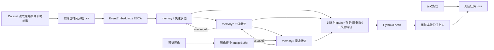

# HMNet 仓库使用与学习指南

> 后续环境更新：已完成pytorch环境补依赖与API兼容维护，当前运行方法和验证结果见 [环境配置记录](03_pytorch环境配置与兼容性记录.md)。本文其余内容保留首次静态核查时的状态。

> 检查日期：2026-09-15（Asia/Shanghai）。本文依据本地源码静态阅读和少量数据只读抽查；没有执行模型导入、前后向、训练、推理、评估或测速。下文命令均为**建议执行，尚未运行**，且依赖和数据前置条件尚未满足。后续改造见 [分阶段计划](02_EfficientViT_SFIFO_GrayDVS分阶段改造计划.md)。

## 1. 当前工程身份与本轮边界

| 项目 | 本次核查结果 |
|---|---|
| 根目录 | `/home/zhaowenyao24/Conda_prj/Detection_DVS/HWAware_HMNet` |
| 当前分支 | `main` |
| commit | `168142a7233e2f52f04104553a25df021d786b1a` |
| 配置的 remote | `origin = git@github.com:lionelZhaowy/HWAware_HMNet.git`，fetch/push 相同 |
| 官方来源 | [hamarh/HMNet_pth](https://github.com/hamarh/HMNet_pth)，由本地 README 的项目、任务和权重链接确认；未配置名为 upstream 的 remote |
| 初始工作区 | `git status --short` 为空，没有已存在的未提交修改 |
| 本地约定 | 在祖先路径与当前仓库未找到适用的 `AGENTS.md`；没有既有 `docs/` |
| 本轮产物 | 仅新增本指南和分阶段改造计划；不修改历史文件 |

未 fetch 或比较远端 HEAD，因此不能说当前 fork 与官方最新版本完全一致。文中相对源码链接均指上述 checkout，代码行号会随未来改动变化。附件二作为研究背景，不作为本地已实现功能或实测结果的证据。

## 2. 一页理解 HMNet

HMNet 把高速、不规则的事件写入持续存在的特征状态。三层记忆处理不同时间尺度：第一层每 tick 接收事件，第二、三层较慢更新，再把上下文消息送回低层。任务 neck 汇合多个空间尺度，任务 head 计算检测框、语义类别或深度。

**三任务是三套实验配置和分别训练的权重。三层记忆不是三个任务各占一层。** 该仓库没有默认的一套共享权重联合训练三个头的入口。



事件是 `(t,x,y,p)` 的点列表，不是红绿事件可视化图，也不是实验室未来的固定尺寸时间表面。ESCA将事件按坐标映射到对应latent空间窗口，用latent产生Q、事件嵌入产生K/V，通过稀疏softmax和scatter聚合写入；默认噪声过滤还有可学习dustbin权重。这与后续拟议的全局KᵀV线性摘要不同。分割/深度融合配置中的图像是既有 RGB 通路；MVSEC 原始灰度通过复制成三通道进入此通路。

## 3. 目录地图

覆盖当前所有主要一级项；实验数据目录存在不代表数据已经准备好。

| 路径 | 职责与阅读入口 |
|---|---|
| [README.md](../README.md) | 原论文结果、环境安装示例、三任务索引、权重链接。其精度与延迟是官方报告，不是本机测量 |
| [requirements.txt](../requirements.txt) | 仅 `pybind11`、`hdf5plugin`、`pandas`，并非完整环境锁定文件 |
| [LICENSE](../LICENSE) | 主体许可；README 另列第三方文件与权重许可 |
| [.gitignore](../.gitignore) | 忽略数据、权重、workspace、psee_toolbox 等生成物；以后记录实验不能只依赖 git status |
| `.git/` | 分支与提交元数据，本轮只读 |
| [hmnet/dataset/](../hmnet/dataset/) | GEN1、DSEC、Eventscape、MVSEC；`EventPacket`、`EventPacketStream`、可选 `EventFrameStream`；collate 与迭代器 |
| [hmnet/models/base/](../hmnet/models/base/) | backbone、neck、head、criterion、event_repr，以及层、初始化与 `BlockBase` 通用工具 |
| [hmnet/models/detection/](../hmnet/models/detection/) | `HMDet` 包装器 |
| [hmnet/models/segmentation/](../hmnet/models/segmentation/) | `HMSeg` 包装器 |
| [hmnet/models/depth/](../hmnet/models/depth/) | `HMDepth` 包装器 |
| [hmnet/utils/](../hmnet/utils/) | 空间变换及逆变换、日志、文件列表、计时器、学习率函数；预期额外存在的 `psee_toolbox` 当前缺失 |
| [experiments/detection/](../experiments/detection/) | README、config、训练/测试/Prophesee 评估脚本、GEN1 数据准备脚本 |
| [experiments/segmentation/](../experiments/segmentation/) | README、config、训练/测试/mIoU 评估、DSEC 数据准备 |
| [experiments/depth/](../experiments/depth/) | Eventscape 预训练、MVSEC 微调/测试、深度指标和 RPG 对照格式工具 |
| `docs/` | 本轮新增的学习与规划文档 |

`backbone/old/` 是旧实现，不是典型配置选择的主路径；ResNet/ConvNeXt/CSPDarknet 及 GRU/Swin 变体是其他骨干。`head/` 也有 UPer、PPM 等实现，不能据其存在就把所有实验称作 UPerNet。`extract_gt_frames_for_rpg.py`、`preproc_for_rpg.py` 用于深度对照数据处理，不代表新增跟踪任务。

当前 `experiments/*/data/*/` 都是普通目录，仅有 `scripts/`，未见实际数据链接、list、meta、source；未见任务 `pretrained/` 或 `workspace/`。以上仅指本 checkout，不能推断整台服务器没有同类数据。

## 4. 推荐阅读顺序

1. 根 README → 当前任务 README，先分清训练阶段和数据集。
2. 一个具体配置，例如 [检测 B3](../experiments/detection/config/hmnet_B3_yolox.py)、[分割左 RGB B3](../experiments/segmentation/config/hmnet_B3_fuse_left_rgb.py)、[深度 RGB B3](../experiments/depth/config/hmnet_B3_fuse_rgb.py)。先找 `TRAIN_DURATION`、`DELTA_T`、`get_dataset()`、`get_model()`。
3. 对应 `scripts/train.py` 的 `get_config → main → train → parse_event_data`，理解时间列表和批次。
4. Dataset 的 `getdata → _load → __getitem__`，再读 [collate_keep_dict](../hmnet/dataset/custom_collate_fn.py) 和 [PseudoEpochLoader](../hmnet/dataset/custom_loader.py)。
5. HMDet/HMSeg/HMDepth 的 `forward` 与 `inference`，确定监督筛选位置。
6. [HMNet.forward / _forward_one_step](../hmnet/models/base/backbone/hmnet.py#L111) → [LatentMemory](../hmnet/models/base/backbone/latent_memory.py#L59) → EventEmbedding、EventWrite、ImageWrite。
7. [Pyramid](../hmnet/models/base/neck/pyramid.py) 和具体 task head 的 `loss`、`inference`、后处理。
8. `scripts/test*.py` 保存逻辑 → 独立评估脚本。不要从训练 loss 直接推断最终任务指标。

## 5. 环境和数据前置条件

### 5.1 环境实况

仅用 `importlib.metadata` 查询包元数据，没有导入 torch 或调用 CUDA。

| 项目 | 当前 shell 的 base | 已有 `/opt/miniconda3/envs/pytorch` |
|---|---|---|
| Python | 3.13.11 | 3.12.2 |
| torch / torchvision | 未安装 | 2.5.0 / 0.20.0 |
| numpy / pandas | 2.4.1 / 2.3.3 | 1.26.4 / 2.2.3 |
| timm | 未安装 | 1.0.15 |
| h5py / hdf5plugin | 未安装 | 3.12.1 / 5.0.0 |
| torch-scatter | 未安装 | 未安装 |
| pybind11 | 未安装 | 未安装 |
| Pillow / OpenCV | 12.2.0 / 未安装 | 10.4.0 / 4.10.0 |
| pycocotools / einops | 未安装 | 2.0.8 / 0.8.1 |

本地 README 声明 PyTorch >=1.12.1，安装示例为 Python 3.7、torch 1.12.1、torchvision 0.13.1、CUDA toolkit 11.3，另装匹配的 torch-scatter 和 timm。这只是仓库记录的参考组合，不能等同于已验证所有较新版本。

静态兼容风险：

- [latent_memory.py](../hmnet/models/base/backbone/latent_memory.py#L44) 顶层导入 `torch_scatter`；[backbone/builder.py](../hmnet/models/base/backbone/builder.py) 无条件导入 HMNet。新增稠密骨干注册后仍可能因旧骨干导入而失败。
- [event_repr/basic.py](../hmnet/models/base/event_repr/basic.py#L35) 也顶层导入 scatter，Dataset 导入 event_repr builder 又能触发它。未来隔离依赖需要检查两条导入链。
- Dataset 多处使用 `np.int`、`np.float`；已有 NumPy 1.26.4 的兼容性需要处理，不能假设现有 FAOD 环境已能运行 HMNet。
- 多处 `timm.models.layers`、旧 Storage/AMP API、`SourceFileLoader.load_module()` 属于旧式用法；兼容性需在下一轮最小导入测试确认，不在本轮修复。
- GEN1 预处理和检测评估依赖 `hmnet/utils/psee_toolbox`，当前没有该目录。YOLOX NMS 依赖 torchvision，COCO 指标依赖 pycocotools。
- 没有 setup.py/pyproject 安装入口。建议未来显式设置 `PYTHONPATH`，不要直接在 base 执行训练。

未查询 GPU 型号、占用、可用显存和驱动，也未测试 CUDA/扩展 ABI。相邻 FAOD 的环境记录只作为线索，不把其已跑通结果归给 HMNet。下一轮应先选定环境方案，不升级共享环境来试错。虽然测试CLI有`--cpu`，包装器inference直接创建CUDA stream，不能据参数存在就承诺CPU路径可用。

### 5.2 官方数据协议

| 任务 | 所需数据、索引与位置（相对任务目录） | 源码证据 |
|---|---|---|
| 检测 | GEN1 原始 `.dat` 与框 `.npy` 经处理成 `train_evt/val_evt/test_evt`、相应 `*_lbl`；`list/<split>/events.txt`、`labels.txt`、meta、GT interval 信息 | [gen1.py](../hmnet/dataset/gen1.py)、[GEN1 scripts](../experiments/detection/data/gen1/scripts/) |
| 分割 | DSEC events HDF5 的 `events`，图像/标签 HDF5 的 `data_ts` 和 `data`，各 split list/meta/video_duration | [dsec.py._load](../hmnet/dataset/dsec.py#L209)、[预处理](../experiments/segmentation/data/dsec/scripts/) |
| 深度预训练 | Eventscape 合并事件 `.npy`；图像和深度的 info `.npy` 中存 `t` 与路径，深度文件为逐帧 `.npy` | [eventscape.py._load](../hmnet/dataset/eventscape.py#L224) |
| 深度微调/测试 | MVSEC `outdoor_*_data.hdf5`、`*_gt.hdf5`、`*_meta.npy`；训练 day2，测试 day1/night1 | [mvsec.py](../hmnet/dataset/mvsec.py)、深度配置 `FTSettings/TestMVSEC` |

原始数据不直接等同于配置要求的处理后文件；只拷贝原始数据路径不足以运行。官方 prepair 脚本会产生大量文件，有些存在路径疑点，见第 11 节；此轮没有执行下载、链接、预处理或建立缓存。

### 5.3 PEOD 与相关工程的有限抽查

以下路径都存在：

- `/home/zhaowenyao24/Conda_prj/Detection_DVS/HWAware_FAOD`：选择性阅读 `docs/PROJECT_HANDOFF.md`、`ENVIRONMENT.md`。
- `/home/zhaowenyao24/Conda_prj/Detection_DVS/RENet_PEOD`：选择性阅读 `docs/PEOD_240HZ_USAGE.md`，核对类别映射，不采用其输入二值化作为目标。
- `/data/lab_dataset/RGB_DVS_DET/PEOD_orig`：只读原始数据。本轮没有在该目录生成任何文件。

具体抽样 `sequence_001`：

| 证据 | 结果 |
|---|---|
| `train/sequence_001.dat` 文件头 | `% Height 720`、`% Width 1280`、`% Version 2`；只读头部，没有全量解码 |
| `rgb/train/sequence_001/sequence_001_0001.png` | Pillow 读取尺寸 1280×720、RGB；该目录 962 个文件 |
| `timestamp/train/sequence_001.csv` | **无表头**，962 行、2 列；前几行第一列均为 1，第二列从 1590802、1624260、1657718 开始；按微秒解释间隔中位数 33461、最小 33456、最大 66924，约 29.9 Hz 且存在间隙 |
| `annotations/train/challenge/sequence_001.json` | COCO 风格，962 个 image record、1742 个 annotation；image_id 从 0 开始，文件名从 `_0001.png` 开始，bbox 是浮点 `xywh` |
| categories | 0 car，1 person，2 bus，3 truck，4 2-wheeler，5 3-wheeler |
| 空框与其他标签 | 50 个 image record 无 annotation；1742 个 annotation 的 `segmentation` 都为空，未见深度标签字段 |

CSV 本身没有单位列；微秒解释与已有读取约定、间隔及数据说明的 30 Hz 一致，完整事件时钟原点与相机对齐仍待联合验证。962 行与 962 张图/record 一致支持“CSV 行序映射排序图像”的候选方案，尚未完成全序列图像—事件可视化确认。不能把第一列当 frame_id，也不能跳过首行当表头。

50 个零 annotation 的 image record 应与“没有 image/标注记录”的时刻分开保存；是否全部属于完成标注的负样本，下一轮还要核查标注完整性。该抽样不是全数据集统计。原始 `train/`、`test/challenge|normal/` 是实际事件目录，和数据 README 中 `event/train` 示意存在差别。

PEOD 检测数据不能提供可靠语义分割或米制深度监督。实验室目标 Gray 1024×720、DVS 512×360 也不是此次原始文件的尺寸，转换协议见改造计划。

## 6. 配置如何决定运行

配置是会被执行的 Python 模块，不是 YAML。三任务训练脚本通过 `machinery.SourceFileLoader(...).load_module()` 加载 `TrainSettings()`；深度 `--finetune` 选择 `FTSettings()`；测试分别选择 `TestSettings`、`TestEventscape`、`TestMVSEC`。

| 控制项 | 代码来源/意义 |
|---|---|
| 模型 | 模块全局 `backbone/neck/head` 字典 → `get_model()` → 各 builder；初始化通常 `init_weights()` |
| 数据 | `get_dataset()` 的文件路径、sampling、增强、空桶/最近标签选项 |
| 空间尺寸 | `INPUT_SIZE` 是 `(H,W)`；`latent_sizes` 是各状态网格，`latent_dims` 与 `output_dims` 分别为内部/读出通道 |
| 事件窗/输出步长 | `DELTA_T`、`delta_t` 单位微秒；`stride_t/stream_stride` 决定 tick 间隔；`TRAIN_DURATION` 决定采样片段物理长度 |
| batch | `loader_param`；典型配置 16，DDP 按 world_size 分配；`--single` 特别执行除以 16，不只是设备选择 |
| 优化器 | `optimizer=AdamW`、`optim_params`，经 `model.optim_settings` 生成参数组 |
| 学习率 | `CombinationV2` + `LambdaLR`，典型 lr=2e-4、weight_decay=0.01、cosine 到 1e-7；`scheduler.step(loader.nowiter)` |
| 训练步数 | `N_SAMPLES // batch_size` 给 `iter_per_epoch`，再乘 `NUM_EPOCHS`；PseudoEpochLoader 的 epoch 是指定迭代数，不必等于数据遍历一圈 |
| 初始化权重 | 配置 `load`，只匹配/加载模型参数；检测 TBPTT 从短序列模型初始化，深度 FT 从 Eventscape 初始化 |
| 恢复 | 配置 `resume`，相对 workspace 的 checkpoint 文件名；读取 epoch、模型、optimizer、可选 scaler |
| 输出目录 | 训练脚本用配置 basename 建 `./workspace/<name>/`；不是由工作区根目录统一接收 |
| 测试权重 | `--pretrained <文件>` 优先，否则按配置 `checkpoint` 从 workspace 加载；无需也不应默认 `--random_init` |

典型 B3 训练参数：

| 实验 | 输入 H×W | tick / 片段 | 三层周期 | 三层网格 | epochs |
|---|---|---|---|---|---|
| GEN1 短序列 | 240×304 | 5 ms / 200 ms = 40 tick | 1/3/9 tick | 60×76、30×38、15×19 | 90 |
| GEN1 TBPTT | 240×304 | 5 ms / 8.1 s | 同上 | 同上 | 1（大采样规模，不等于 smoke test） |
| DSEC 左 RGB | 440×640 | 5 ms / 200 ms | 同上 | 110×160、55×80、28×40 | 180 |
| Eventscape RGB | 256×512 | 5 ms / 200 ms | 同上 | 64×128、32×64、16×32 | 30 |
| MVSEC FT | 260×348（原宽 346 padding） | 5 ms / 200 ms | 同上 | 65×87、33×44、17×22 | 30 |

`--single`修改batch发生在配置类的迭代预算计算之后，因此不会自动按新batch重算训练预算；TBPTT每段都optimizer.step，但scheduler参数仍是同一batch的loader.nowiter。下一轮短实验需显式记录这些行为。

上述 B3 内部通道 `[128,256,256]`，读出 `[256,256,256]`。典型 tick 是 **200 Hz**，不是部署目标 240 Hz。TBPTT 配置为 10 段 × 810 ms，每段 162 tick；不是 4/8 tick 的有限 FIFO。

## 7. 三任务实际使用命令

**以下全部未执行。** 先解决环境与数据；每段从指定任务工作目录运行。`${HMNET_ROOT}`、`${HMNET_PY}` 是用户将来设置的绝对路径，`${WEIGHTS}` 是与任务/架构/训练阶段匹配的权重文件，不是通用同一份权重。

```bash
# 建议执行，尚未运行；HMNET_PY 指向下一轮确认兼容的环境
export HMNET_ROOT=/home/zhaowenyao24/Conda_prj/Detection_DVS/HWAware_HMNet
export HMNET_PY=/绝对路径/兼容环境/bin/python
export PYTHONPATH="$HMNET_ROOT${PYTHONPATH:+:$PYTHONPATH}"
```

### 7.1 检测：短序列 → TBPTT → 推理 → 独立评估

参数已与 [train.py](../experiments/detection/scripts/train.py#L33)、[test.py](../experiments/detection/scripts/test.py#L34) 核对。下面训练命令是完整训练入口，**不是最小实验命令**。

```bash
# 建议执行，尚未运行
cd "$HMNET_ROOT/experiments/detection"
"$HMNET_PY" scripts/train.py config/hmnet_B3_yolox.py --single --seed 42
# 前一阶段完成后才可启动；配置 load 指向其 checkpoint
"$HMNET_PY" scripts/train.py config/hmnet_B3_yolox_tbptt.py --single --seed 42

# WEIGHTS 应指向检测 B3 TBPTT 权重的绝对路径
"$HMNET_PY" scripts/test.py config/hmnet_B3_yolox_tbptt.py data/gen1/list/test/ data/gen1/ --pretrained "$WEIGHTS" --mode single_process
"$HMNET_PY" scripts/psee_evaluator.py data/gen1/test_lbl/ workspace/hmnet_B3_yolox_tbptt/result/pred_test/ --camera GEN1
```

验证集使用 `data/gen1/list/val/` 替代 `list/test/`，预测目录相应为 `pred_val/`，评估 GT 换 `data/gen1/val_lbl/`。脚本 `run_eval.sh <config>` 硬编码 `pred_test`，不能直接用于 val。

`--amp` 可在 FP32 基线稳定后添加。`--fast` 是 fast 模型转换、事件/KV 查表路径，应作为单独数值一致性检查；`--speed_test` 才是计时，不是运行推理的必要参数。

### 7.2 分割：DSEC-Semantic

初学者先用官方 event-only B3；左 RGB 变体另用 `hmnet_B3_fuse_left_rgb.py` 及其专用权重。

```bash
# 建议执行，尚未运行
cd "$HMNET_ROOT/experiments/segmentation"
"$HMNET_PY" scripts/train.py config/hmnet_B3.py --single --seed 42
"$HMNET_PY" scripts/test.py config/hmnet_B3.py data/dsec/list/test/ data/dsec/ --pretrained "$WEIGHTS" --mode single_process
"$HMNET_PY" scripts/eval_seg.py workspace/hmnet_B3/result/pred_test/ data/dsec/test_lbl/ workspace/hmnet_B3/result/pred_test/logs/ 11 --pred_type npy_files --gt_type hdf5_files --gt_hdf5_path data
```

上例保留官方 `run_eval.sh` 的参数协议。训练 ignore=255，而官方 eval shell 没有传 `--ignore_index 255`，不能把两者默认为相同；实际 GT 是否含 255 及其对 union 的影响必须核查并分别记录。未来修订协议时可明确加该参数，但不得把新协议结果直接冒充原协议复现。

只有已建立并核实独立验证 split，才把输入列表、GT 和输出同时改为 val；不能臆造当前不存在的 DSEC val 划分。右 RGB 配置的测试还需检查 `--fuse_right`，不能只换配置名。

### 7.3 深度：Eventscape → MVSEC

```bash
# 建议执行，尚未运行
cd "$HMNET_ROOT/experiments/depth"
"$HMNET_PY" scripts/train.py config/hmnet_B3.py --single --seed 42
"$HMNET_PY" scripts/test.py config/hmnet_B3.py data/eventscape/list/test/ data/eventscape/ --pretrained "$WEIGHTS" --mode single_process
# 根据实际生成的 labels.txt 路径调用；此处是配置/预处理约定下的建议命令
"$HMNET_PY" scripts/eval_depth.py workspace/hmnet_B3/result/pred_test/ data/eventscape/list/test/labels.txt workspace/hmnet_B3/result/pred_test/logs/ --max_depth 1000 --min_depth 3.346 --cutoff_depth 30 20 10 --input_type info --skip_ts 199.9 --gt_root data/eventscape/

# MVSEC 微调在现有 Eventscape workspace 中进行；先保留已有日志/checkpoint 的副本
"$HMNET_PY" scripts/train.py config/hmnet_B3.py --single --seed 42 --finetune --overwrite
# 此时 WEIGHTS 应换为 MVSEC B3 权重，不能仍用 Eventscape 权重
"$HMNET_PY" scripts/test_mvsec.py config/hmnet_B3.py day1 --pretrained "$WEIGHTS" --mode single_process
"$HMNET_PY" scripts/test_mvsec.py config/hmnet_B3.py night1 --pretrained "$WEIGHTS" --mode single_process
"$HMNET_PY" scripts/eval_depth.py workspace/hmnet_B3/result/pred_day1/outdoor_day1_data.npy data/mvsec/source/outdoor_day1_gt.hdf5 workspace/hmnet_B3/result/pred_day1/logs/ --max_depth 80 --min_depth 1.978 --cutoff_depth 30 20 10 --input_type mvsec
```

night1 的评估对应替换三处 day1。`test_mvsec.py` 从固定 `data/mvsec/source/` 构建输入路径，不接受 test.py 那种 `data_list/data_root` 两个位置参数。深度 README 下载名 `mvsec_hmnet_B3.pth` 与示例传参 `hmnet_B3_mvsec.pth` 不一致，使用实际文件路径。

Eventscape `run_eval_eventscape.sh` 中 `./data/list/test_lbl.txt` 与当前配置及 prepair 生成的 `data/eventscape/list/test/labels.txt` 不一致，因此上面给出经参数解析核对的直接命令，但数据到位后仍需核实列表内容。`prepair.sh -a` 把 Eventscape val/test 都列为 `test_*`，不能直接用该 val 作独立调参集；`make_depth_info.py`本身有Town05的VAL_IDS分离逻辑，问题在列表脚本，不应据此否定原数据的验证划分。

### 7.4 三任务恢复训练的正确入口

训练 CLI **没有 `--resume`、`--epochs`、`--batch-size` 参数**。将来应在独立实验配置的 `TrainSettings.resume`（深度 FT 用 `FTSettings.resume`）设置相对输出目录的文件名，再调用：

```bash
# 建议执行，尚未运行；以下配置名是下一轮待建立的独立配置，并非当前文件
# 前提：对应 workspace 已有 checkpoint，配置 resume='checkpoint.pth.tar'
cd "$HMNET_ROOT/experiments/detection"
"$HMNET_PY" scripts/train.py config/hmnet_B3_yolox_smoke.py --single --overwrite --seed 42
cd "$HMNET_ROOT/experiments/segmentation"
"$HMNET_PY" scripts/train.py config/hmnet_B3_smoke.py --single --overwrite --seed 42
cd "$HMNET_ROOT/experiments/depth"
"$HMNET_PY" scripts/train.py config/hmnet_B3_smoke.py --single --overwrite --seed 42
# MVSEC 恢复需 FTSettings.resume='checkpoint_ft.pth.tar' 并额外传 --finetune
```

深度Eventscape验证可按与test.py相同参数形式切换到`list/val/`，评估同步切换对应labels.txt和pred_val；前提是先修正/核实独立val manifest，不能使用当前shell误指test的列表。MVSEC day2是微调数据，不能把其评估当作独立泛化验证。

`resume` 是续训状态，`load` 是参数初始化，`--pretrained` 是测试权重。`--overwrite` 允许进入已有 workspace，`train.csv` 会以写模式打开，因此先归档旧日志；`--clean` 会删除输出目录，不用于恢复。checkpoint 未存数据迭代器、随机数和跨帧状态，不能声称逐步精确复现中断前的采样轨迹。

`--debug` 在训练脚本中仍设置 4000 iteration，不是 1～2 步 smoke test。最小实验需要下一轮新增独立短运行配置/诊断入口，见第 12 节。

## 8. 数据、张量与监督的实际调用链

### 8.1 接口表

| 接口 | 输入 | 输出/关键契约 |
|---|---|---|
| Dataset `EventPacketStream.__getitem__` | 一个采样片段索引 | 时间长度 T 的 `data_streams,target_streams,meta_streams`；不是单帧 |
| `collate_keep_dict` | B 个片段 | 序列转为时间优先 T×B；dict 保持列表，避免把变长事件强行 stack |
| 检测 `parse_event_data` | datas,targets,metas | `list_events,list_image_metas,list_gt_bboxes,list_gt_labels,list_ignore_masks` |
| 分割/深度 parser | 同上，含 images | `list_events,list_images,list_image_metas,list_labels` |
| `HMNet.forward` | T×B 事件、元数据、gather_indices，可选图像 | 三个 `[M,C_i,H_i,W_i]` 特征；M 是选中的 `(time,batch)` 数量 |
| `HMNet.inference` | 一个 tick 的 B 条事件与 meta，可选图像 | 三层当前可读缓存 `[B,C_i,H_i,W_i]`，启动期间可能含 None |
| 任务包装器 `forward` | 多 tick 输入和任务 GT | `loss,log_vars,num_samples`；不是三任务联合 loss |
| 任务包装器 `inference` | 多 tick 输入 | 预测和对应 meta；内部逐 tick 调 backbone，然后 termination |

原始事件的每个 `list_events[t][b]` 是 `[N_tb,4]`：`t` 为片段时间坐标中的微秒，`x/y` 为像素位置，`p` 为极性。GEN1 默认 stream 输出 float32、极性 -1/+1；fast 测试 `output_type='long'` 转 0/1 配合离散查表。DSEC/Eventscape/MVSEC 也有 dtype/极性分支，不能忽略配置直接混用。仓库另有Histogram/TimeSurface/VoxelGrid表示；TimeSurface默认两种tau（10000/100000 μs）且保留极性，通道数为`len(tau)*(1+keep_polarity)`，默认4通道，并非目标传感器已定的一/二通道；可选time_stamp输入/返回决定跨窗状态传递。`EventEmbedding.preproc_events` 再减 `curr_time_crop-delta_t`，得到当前窗内时间；**它会原地修改传入事件的时间列**，同一对象重复前向时应验证是否被二次减去偏移。

MVSEC 磁盘 events 为 `x,y,t,p`、时间秒；`_load` 乘 1e6 并减数据起点，`_bind` 重排为 `t,x,y,p`。这说明“磁盘列顺序”和“模型列顺序”必须分开记录。

`curr_time_org` 表示数据序列时钟中的当前窗末，`curr_time_crop` 是片段内窗末，`delta_t` 是窗长，`stride_t` 是更新间隔。默认 5 ms 时以 `[0,5000)`、`[5000,10000)` 分桶，元数据窗末分别为 5000、10000；标签/图像也按时间桶放入，桶内通常取最后一项。不要把桶末输出时间等同于未经量化的标注原时间。

### 8.2 一个 GEN1 B3 训练样本

以下形状由配置和代码推导，**未运行实测**。设 B=1、T=40，片段长 200000 μs，假定片段中的合法标注落在 tick 30。

1. [gen1.EventPacket.getdata](../hmnet/dataset/gen1.py#L145) 选择文件/起点，mmap 读取部分事件，加载框，变换坐标，转换 `xywh → xyxy`，生成 ignore 和标注时刻 dummy。`_label_padding` 使用 GEN1 GT interval 推导完整标注帧；这项数据集假设不能照搬稀疏 PEOD。
2. [EventPacketStream.__getitem__](../hmnet/dataset/gen1.py#L485) 分桶，事件成为 40 个 `[N_t,4]`，无监督桶的 labels 是 None；真实标注时刻即使框被全部移除，也可保留空 labels 张量，供背景监督。
3. collate → parser → [HMDet.forward](../hmnet/models/detection/hmdet.py#L97)。`_identify_required_outputs_batch` 收集 labels 非 None 且 `tidx+idx_offset > warmup` 的位置。例如这里只有 tick 30，则 M=1，`gather_indices={time:[30],batch:[0]}`。
4. [EventEmbedding.forward_fast_train](../hmnet/models/base/backbone/latent_memory.py#L1018) 提前把整段事件拼接做位置/时间/极性嵌入、K/V 投影，再按 tick 拆开。配置嵌入通道 32+32+32=96；它仍是逐事件 token，不是三通道图像。
5. HMNet 依次执行全部 40 tick。内部 latent 为 `[1,60*76,128]`、`[1,30*38,256]`、`[1,15*19,256]`；读出通道都是 256。tick 30 的三层缓存收集成 `[1,256,60,76]`、`[1,256,30,38]`、`[1,256,15,19]`。
6. [Pyramid.forward](../hmnet/models/base/neck/pyramid.py#L74) 做 bottom-up 和 top-down 加法融合；[YOLOXHead](../hmnet/models/base/head/task_head/det_head_yolox.py) 在 /4、/8、/16 网格给框、objectness、类别，训练 `loss` 匹配 GT。后续无标签 tick 仍推进状态，不产生背景标签。
7. 骨干返回前 detach 持久状态，已返回特征保留本段计算图；trainer 对这段 loss 反向和 optimizer.step。下一随机 batch 重新 init_states。

### 8.3 一个分割/深度样本

DSEC 左 RGB B3 同样有 T=40。Dataset 从 HDF5 读取事件和 `(3,440,640)` 图像，图像没有到达的 tick 用 None；语义标签在有标注桶为 `(1,440,640)`，其他桶为 None。`HMSeg.forward` gather M 个标签并 stack，三尺度如配置表。主头经 neck 的最高分辨率输出上采样到 `[M,11,440,640]`；辅助头直接读 `features[0]`，两项 CE 相加。图像经过 ImageBuffer，在 memory3 的写入相位参与更新，不是每个 tick 重算 RGB 编码。

Eventscape 样本由 `.npy` 事件及 info 路径读取 RGB 和米制深度；`HMDepth.forward` gather 后 GT 为 `[M,1,256,512]`，head 输出同尺寸 logits，loss 内映射到归一化 log-depth 域。MVSEC 同理，但输入灰度先复制成 3 通道、宽度 padding 346→348，GT/预测有效区域和反变换须同步。

## 9. 三层记忆的时间线和状态生命周期

依据 [LatentMemory._timing_flags](../hmnet/models/base/backbone/latent_memory.py#L201)、`_forward`、`sync_and_get_state`。典型配置 `start_from_cycle_end=True`，内部零基 idx 从 0 开始：

| 零基 tick | memory1 (freq=1) | memory2 (freq=3) | memory3 (freq=9) |
|---|---|---|---|
| 0 | 写入/更新/读出 | cycle_ed，初始无已完成读出 | cycle_ed，初始无已完成读出 |
| 1 | 同上 | cycle_st，写入/更新并算 out | cycle_st，写图像/下层输入，更新并算 out |
| 2 | 同上 | 缓存尚待发布 | 保持输出缓存 |
| 3 | 同上 | cycle_ed，同步发布上次 out，生成下行消息 | 保持输出缓存 |
| 4 | 同上 | 下一个 cycle_st | 保持输出缓存 |
| 9 | 同上 | 周期边界 | cycle_ed，发布 tick 1 计算的 out |
| 10 | 同上 | cycle_st | 下一次 cycle_st |

cycle_st 条件 `(idx-1)%freq==0`，cycle_ed 为 `idx%freq==0`。频率是周期 tick 数，在 5 ms tick 下为 5/15/45 ms，但“计算启动”和“输出缓存可读”存在相位差。不能简单写成每第 3/9 帧直接刷新所有输出。

[HMNet._forward_one_step](../hmnet/models/base/backbone/hmnet.py#L151) 先同步并取旧 `z1,z2,z3,message2,message3`，再调用 memory3、memory2、memory1。因此上层消费同步取得的下层状态，不是本 tick 刚更新完的最低层特征。

状态包含 `latent`、`message`、`out`、`out_buffer`、`time_idx`；融合 memory3 另有 ImageBuffer。ImageBuffer 保留最新像素图和逐 batch valid_mask，`read()` 清除有效标记。新图可以在任意 tick 写入，消费发生在记忆写入相位；期间多图会覆盖为最新一张。它并非目标设计中持久缓存多尺度 Gray 特征的同一机制。

记忆自身的 message warmup 是 `idx > freq+1`；任务包装器另按 backbone 默认 `warmup=20` 严格 `>` 筛选监督，即零基 tick 21 起才可能选中。两种 warmup 不要混为一谈。

训练生命周期：

```text
随机采样片段 → （可选拆段）
第 0 段 init_states=True → 所有 tick 前向 → detach 状态 → 反向/更新
第 1 段 init_states=False → 携带数值状态 → detach → 反向/更新
…… → 新采样片段再次 reset
```

三任务 trainer 都含分段辅助函数；典型分割/深度配置不设分段，因此每个 200 ms 片段只有一次 forward。`split_into_segments` 仅保留最后 `num_train_segments` 段，再从保留段的第一段初始化，不会自动在被丢弃前缀上 warmup。只有分段内部同一个 batch 槽位保持同一序列；没有通用的每条 sequence_id 状态管理器。

`adapt_segment_durations` 在候选段长列表时用 `len(e)` 估算事件数量峰值；固定段长则直接返回。改成 `[B,C,H,W]` 帧后 `len(e)` 变成通道数，原估算不再代表显存成本，需未来另定固定 tick/激活预算。

包装器每次 `inference(list_...)` 开头调用 `prepair_for_inference` 初始化，结束 termination。任意多次调用并不自动组成不间断流；测试 loader 跨 chunk 的状态续接和 warmup 要明确验证。新模型不能只给一个 `step()` 就声称兼容全部旧接口。

## 10. 任务头、标签和评价

| 任务 | 实际结构与损失 | 后处理/协议 |
|---|---|---|
| 检测 B3 | Pyramid → YOLOXHead，2 类，strides=[4,8,16]，两层分支卷积、SiLU；动态匹配，5×IoU loss + objectness BCE + classification BCE，默认不启用可选 L1 | sigmoid 得分、exp 解码宽高，score=obj×cls，score_thr=.01、NMS IoU=.65；输出 xyxy 再存评估格式 |
| 分割左 RGB B3 | Pyramid → SegHead 主头，features[0] → SegHead 辅助头；11 类，主 CE 系数1、辅助 .4，ignore=255；BN/ReLU | logits 双线性上采样；推理 softmax，test.py argmax 存整型类别；mIoU、各类 IoU、overall accuracy |
| 深度 RGB B3 | Pyramid → DepthRegHead，GroupNorm/SiLU，3×3+1×1 输出单通道；SIGLoss 系数1 + 三尺度 GMLoss 系数.25 | logits 双线性上采样，sigmoid 后做 log-depth 反映射；输出是深度，不是未经转换的 logits |

源码：[YOLOXHead](../hmnet/models/base/head/task_head/det_head_yolox.py)、[SegHead](../hmnet/models/base/head/task_head/seg_head.py)、[SegLoss](../hmnet/models/base/criterion/seg_loss.py)、[DepthRegHead](../hmnet/models/base/head/task_head/depth_reg_head.py)。

数据归一化/几何：

- GEN1 原始事件坐标随随机 resize/crop/flip 变化，原始事件路径没有 RGB mean/std；小框对角线<30 或短边<10 标记 ignore，配置 `ignore_bboxes_as_negative=True` 的含义需保留，不能假设 ignore 全部完全不影响 objectness。
- DSEC 原高480，工程工作区高440。预处理图像 resize 后保留顶部440；标签按已有标签文件加载。RGB 按 0～255 量级统计标准化：mean `[78.32271813,82.63940533,86.36723003]`，std `[68.91888093,73.94419327,79.91293315]`。增强 padding mask=255，标签 resize 默认最近邻，不能双线性插值类别 ID。
- Eventscape RGB mean `[93.693515,94.399027,96.141395]`、std `[53.938046,52.463300,54.016670]`；灰度选项 mean94.386783/std52.621100。MVSEC 典型配置选同一 eventscape 灰度统计并复制通道，而不是重新按 ImageNet 标准化。
- 深度训练有效掩码默认 `min_depth <= GT <= max_depth`；Eventscape [3.346,1000]，MVSEC [1.978,80]，单位沿数据协议为米。padding=-1 无效。归一化 log-depth 使用 `alpha=log(max/min)`，测试 `max*exp(alpha*(sigmoid(logit)-1))` 还原；不是回归一个任意亮度图。
- `_sigloss` 分母是有效像素数，没有对零有效像素的明确保护，极端样本必须验证。GMLoss 在掩码处理后的误差图上进行池化/Sobel，边界行为也要保留或单独评估。

评估区别：

- [psee_evaluator.py](../experiments/detection/scripts/psee_evaluator.py) 过滤最初0.5 s和过小框，GEN1 时间匹配容差±25000 μs，再由 [coco_eval.py](../experiments/detection/scripts/coco_eval.py) 算 AP。它是 GEN1 协议，不能直接作为 PEOD 六类或精确高速时刻评估。
- [eval_seg.py](../experiments/segmentation/scripts/eval_seg.py) 累积交并集；尺寸不同时会中心裁切，可能掩盖几何错配。train ignore 与 eval 参数差别见第7节；原 run_eval 定义的 SKIP_TS 没有传入调用，不应声称显式跳过了该时间。
- [eval_depth.py](../experiments/depth/scripts/eval_depth.py) 按 GT 范围筛选像素，支持 30/20/10 m cutoff；记录 AbsRel、SqRel、RMSE、RMSElog、SIlog、Log10、a1/a2/a3 等，并对样本结果取均值。Eventscape `--skip_ts` 单位毫秒。MVSEC 通过 depth_indices 对齐输出数组，需核查开头未预测帧与有效 GT 的处理，不能只看文件尺寸。

## 11. 输出与疑似问题记录（本轮未修复）

输出位置在每个任务的 `workspace/<配置名>/`：`pytorch.log`、`train.csv`、配置副本、`checkpoint_<epoch>.pth.tar` 和最新 `checkpoint.pth.tar`；MVSEC FT 用 `checkpoint_ft_<epoch>.pth.tar/checkpoint_ft.pth.tar` 及 FT 日志。没有训练期自动验证/最佳 mAP checkpoint 的主循环。

检测 `test.py` 每序列保存评估用结构化 `.npy`；分割每序列 `[Ngt,1,H,W]` 类别数组，缺项初始化为 -1；Eventscape 保存逐帧深度和时间/路径 info；MVSEC 保存按 GT index 排列的深度数组。分割/深度 head 可在就绪 tick 计算，但包装器只保留 `label_path` 或 `depth_path/depth_indices` 有效时刻；这个导出机制不能拿来直接证明240 Hz输出精度。

| 位置/静态发现 | 触发条件与影响 | 下一轮验证方法 |
|---|---|---|
| [HMDet.forward](../hmnet/models/detection/hmdet.py#L97) 只在 init 时设 idx_offset=0，无后续递增；另两任务有递增 | TBPTT 后续段仍按段内 tick>20 筛标签，可能每段丢弃前21个tick的监督 | 两段输入记录 gather 时间，比较绝对 offset 的期望 |
| [HMSeg._gather](../hmnet/models/segmentation/hmseg.py#L167)、[HMDepth._gather](../hmnet/models/depth/hmdepth.py#L161) 对空索引求 max，forward 又 stack GT | 全无标签或全部处于 warmup 时可能报错；检测有 dummy loss 专门分支 | 全无标签、仅空目标、短段各一例 |
| [HMDet._bbox_head_test](../hmnet/models/detection/hmdet.py#L200) 只检查 detections[0] | batch>1 中首图无框会清空所有结果，首图有框而后图 None 可能报错；默认测试 B=1 不触发 | 两张图分别有/无预测的混合 batch |
| [ImageBuffer](../hmnet/models/base/backbone/latent_memory.py#L1107)、ImageWrite、MP image_input_ 固定3通道 | 真单通道 Gray/双分辨率不只改第一层；缓存空间也可能不匹配 | 不同空间尺寸、单通道、批内异步图像到达 |
| [EventEmbedding.preproc_events](../hmnet/models/base/backbone/latent_memory.py#L1090) 原地改 t | 重用同一事件 tensor 前向可能时间二次偏移 | 比较 clone 输入与复用输入，检查输入是否变化 |
| [DepthBaseHead._sigloss](../hmnet/models/base/head/task_head/depth_reg_head.py#L93) 除 npix | GT 全无有效深度可产生非有限 loss | 全无效 mask 最小样本 |
| [Eventscape prepair.sh](../experiments/depth/data/eventscape/scripts/prepair.sh) 的前三个 python 命令无 `scripts/`，val/test 均指 test_*；eval shell 路径也不同 | 按 README cwd 运行可能找不到文件；验证集可能重合；评估找不到 list | 只在下一轮独立输出目录逐项核路径和 split 清单，勿直接批处理 |
| [数据 numpy 别名](../hmnet/dataset/gen1.py)、builder 顶层 scatter 导入 | 在现有 pytorch 环境导入/取样可能失败 | 最小导入→单样本读取，记录首个实际异常 |
| 包装器 inference 每次初始化，分割/深度保存条件取 image_metas[0] | 多 chunk reset、多 batch 不同步标注可能不符合目标在线语义 | 连续序列分块与整段比较，batch异步标签测试 |
| [train.get_ddp_settings](../experiments/detection/scripts/train.py#L581) 多节点 rank_offset=local_size*node_rank，但 CLI 文档从1编号 | node=1/2 时 rank 范围疑似偏移一组；本轮无多机验证 | 先纸面/单元核算rank范围，最小基线先单卡 |

上述是代码事实及条件性影响，不是已复现故障清单；不同配置可能避开触发条件。发现问题不构成本轮修改授权。

## 12. 已确认、静态推断、待运行验证

**已确认（本地文件/元数据）：** 工程身份及初始干净状态；三类任务入口和配置；检测无图像参数、分割/深度有图像参数；三层周期1/3/9；段末detach；监督gather；头/损失/保存路径；环境版本与缺包；PEOD单序列格式和上述统计。

**静态推断：** 表内张量形状、相位发布过程、空监督/idx_offset/多batch/兼容性问题的可能影响；新适配器需要超出 builder 注册的接口。尚不能据此声称已跑通或缺陷必然影响全部官方结果。

**待运行验证：** 环境导入、数据端点/时间对齐、真实前后向与梯度、checkpoint回读、stream/sequence一致性、实际精度、GPU显存/延迟。下一轮最小建议为**官方 GEN1 B3 短序列、单卡、FP32、200 ms 片段**：准备独立配置只运行1～2次前后向和约10～20次更新，保存/回读checkpoint，对一个连续小片段推理并核对框时间和坐标。暂不先上8.1 s TBPTT或换骨干。

进入该实验前需用户选择/提供：可用官方数据与处理后meta路径、拟用环境方案、是否有匹配权重、GPU及小实验预算；本轮没有发现HMNet已接好的官方数据。若GEN1不可用但其他官方任务数据齐全，先以数据完整的任务做同等最小闭环，避免为凑检测基线大规模下载。

完成本轮后停止，等待下一轮实验指令。
