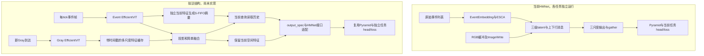

# EfficientViT＋S-FIFO＋Gray–DVS 分阶段改造计划

> 2026-09-15。依据本地 HMNet commit `168142a7233e2f52f04104553a25df021d786b1a`、两份用户附件和只读源码/小样本核查编写。**本文件是后续设计与实验计划，不是已经实现的算法。所有伪代码和命令意图均尚未执行。** 使用说明、环境清单和静态疑点见 [仓库学习指南](01_HMNet仓库使用与学习指南.md)。

## 1. 目标、边界与未知量

服务实验室已有 Dremi 多芯视觉处理器：关注高分辨率视觉、环形 PE、流式再量化/ReLU/写回及多芯部署。本轮不改 RTL、不讨论再次流片、不实施硬件映射。附件中“已有 EfficientViT/LiteMLA 适配”和“去掉除法后效果较好”是用户报告的背景，不是本轮对新时序模型的验证。

首要目标是**同一套骨干结构代码，检测/分割/深度分别训练、分别存权重**。共享预训练初始化是可选后续步骤；一套共享权重加三个头联合训练/同时运行需另立目标。HMNet 的三任务工程不能证明已具备联合多任务训练。MOT、SOT、自监督深度和新标注工程不列入第一阶段。

| 约束 | 目标或当前状态 |
|---|---|
| Gray | 1024×720（W×H），最高按30 FPS评估；模型张量为 `[B,1,720,1024]` |
| DVS | 时间表面512×360（W×H），最高按240 FPS评估；`[B,C_e,360,512]` |
| 名义速率比 | 8个DVS更新/Gray周期；实际必须用时间戳匹配 |
| 时间窗口 | W=4或8；在240 Hz下覆盖约16.67/33.33 ms的输入窗口，首末样本时刻差分别约12.5/29.17 ms；变频后两者都改变 |
| 未定事件表示 | 单通道还是正负极性双通道、衰减函数、tau、量化范围、取帧/积累规则、空窗定义 |
| 未定成像关系 | 时间原点、同步偏移/漂移、Gray时间戳是曝光开始/结束还是其他定义、几何配准和标定形式 |
| 新模块身份 | S-FIFO为研究工作名称，未有本地实现或精度证据 |

不承诺替换骨干后继承原 HMNet 的AP/mIoU/深度精度，也不承诺达到240 FPS，更不把单任务240 Hz目标扩展为三个头同时240 Hz。

## 2. 从本地工程得到的路线判断

推荐新增完整稠密骨干适配器，保留任务包装器的大部分职责、Pyramid neck、头、损失和评估框架。原HMNet及其配置留作不可覆盖的对照。新模型应有独立名称和配置。

理由来自当前源码：

1. [HMNet.forward](../hmnet/models/base/backbone/hmnet.py#L111) 绑定逐事件 EventEmbedding/fast KV、三层状态和 gather；完整EfficientViT的降采样结构无法直接替换一个保持latent网格的update block。
2. [LatentMemory](../hmnet/models/base/backbone/latent_memory.py) 有输出发布相位、跨设备同步、上下行消息和RGB缓冲；层内逐点替换可能保留比4/8帧更长的隐含历史。
3. [builder](../hmnet/models/base/backbone/builder.py) 可注册新骨干，但包装器还依赖warmup、get_dummy_output、设备方法、prepair_for_inference等；普通 [ConvNeXtGRU.forward_sequence](../hmnet/models/base/backbone/convnext_gru.py#L92) 也不等同于HMNet接口。
4. 检测的parse/split/forward/inference没有images参数；分割/深度已有images，但空监督和输出筛选不满足未来任意高速tick导出的全部要求。
5. 原生5 ms、1/3/9周期不是实验室240/30 Hz。把freq改为1/2/8不能自动解决因果时钟和多模态对齐。



图中查询来自当前融合特征是候选之一；S来自独立事件特征有利于约束事件历史，但最终查询来源、是否含当前S、Gray缓存历史跨度仍应配置化。原三层memory及S-FIFO不是默认同时保留。

## 3. EfficientViT候选实现已核查到什么

服务器存在 `/home/zhaowenyao24/Conda_prj/Classification/efficientvit-master-hanlab/`，其：

- [ops.py](../../../Classification/efficientvit-master-hanlab/efficientvit/models/nn/ops.py) 中 `LiteMLA` 从518行开始，默认 `kernel_func='relu'`，包含QKV的1×1卷积、多尺度depthwise/group卷积、投影。
- `relu_linear_att` 对Q/K做ReLU，V补一行常数1，通过矩阵乘法把归一化所需累计量一起计算，再除以最后一行加eps；并非无归一化实现。
- `forward` 依 `H*W > dim` 选择线性或二次注意力路径。导出时必须明确固定输入网格选了哪条路径，不能只检查类名。
- [backbone.py](../../../Classification/efficientvit-master-hanlab/efficientvit/models/efficientvit/backbone.py) 返回 `stage0`、`stage1...`、`stage_final` 字典，而HMNet包装器期待有序三尺度张量列表；需要适配。
- 此目录不是Git checkout，无法记录commit。所读 `ops.py` SHA256为 `6e632634ae60eb6b7fb738b393e7a111bc80e2c074cc4f527fb75e13952fffbe`。没有复制代码或加载权重，没有核查用户各硬件改造变体的等价性。

这足以确认有含LiteMLA的候选，**尚未决定导入哪一份用户变体、哪个B/L规模或哪份权重**。未来冻结候选来源、许可证、文件哈希/commit及修改差异，再引入HMNet。不凭任意同名EfficientViT直接注册，也不把本地无Git目录说成已冻结的官方发布版。

## 4. 空间对齐先于复杂融合

相同stage名称不意味着同网格。原始Gray:DVS的宽高比例2:1，候选配对是Gray /8对DVS /4，而不是两个 /8直接相加。

以下只是**一种padding候选**，尚未选择或实施：在底部补Gray高度720→736、DVS高度360→368，保持宽度1024/512；不裁掉真实区域。

| 公共网格 H×W | Gray特征 | DVS特征 | 后续处理 |
|---|---|---|---|
| 92×128 | 736×1024 /8 | 368×512 /4 | 各自1×1投影到C1，按已标定坐标融合 |
| 46×64 | /16 | /8 | 投影到C2 |
| 23×32 | /32 | /16 | 投影到C3 |

可先把适配输出投影到 `[256,256,256]` 保持现有head契约，之后再单独消融通道数。必须先核查候选实现实际返回的网格、ceil/floor规则和stage通道，上表不是实测shape。

padding位置、坐标原点、resize/crop、是否插值以及标定warp需作为显式配置。若改为居中padding，两个模态的偏移也必须同步。即使网格大小相同，视场/畸变未标定也不能直接逐像素融合。

PEOD原始1280×720到目标Gray1024×720，不是简单2:1缩放。可以研究宽度裁切或带比例变化的resize方案，但这两者的视场/几何意义不同；必须单独选择并对框同步变换。目标DVS再到512×360也要通过同一几何映射，不能各自随机增强。MVSEC还涉及投影深度、内参与有效mask，不采用未经验证的检测resize逻辑。

第一版简单融合建议只选一种：通道投影后加法，或拼接后小卷积；从已有单模态输出加一个变量。Gray分支只在新图到达时编码，缓存各尺度及时间戳；始终保留当前DVS的空间残差，避免陈旧Gray独自承担快速定位。

## 5. 逐文件候选改动表

所有条目都是**未来候选，本轮未改动**。先修基础阻塞并做官方基线，再逐阶段新增；不整合多个仓库的训练框架。

| 文件/范围 | 当前职责 | 未来改动原因/可复用部分 | 任务 | 风险与前置条件 |
|---|---|---|---|---|
| [backbone/builder.py](../hmnet/models/base/backbone/builder.py) | 字典注册且顶层导入全部骨干 | 注册新适配器；将来按需导入；保留旧type | 全部 | 单改此处不解决接口，也不解除event_repr的scatter导入 |
| 拟新增 `backbone/efficientvit_sfifo.py` | 当前不存在 | 整段forward、逐tick step、金字塔output_spec、兼容外壳 | 全部 | 来源冻结、shape/设备/时钟契约 |
| 拟新增时序模块文件 | 当前不存在 | FIFO队列、S/z、有效长度、reset/detach | 全部 | 梯度、精度、冷启动，先显式队列 |
| [hmnet.py](../hmnet/models/base/backbone/hmnet.py) / [hmnet1.py](../hmnet/models/base/backbone/hmnet1.py) | 原记忆骨干 | 保留为官方基线，借鉴遍历/gather语义；不默认在内部替换 | 全部 | 旧持续状态不能混入有限窗口消融 |
| [latent_memory.py](../hmnet/models/base/backbone/latent_memory.py) | ESCA、图像写入、多速率调度 | 保留原模型；借鉴状态生命周期，另建Gray特征缓存 | 全部 | RGB三通道、图像缓冲detach、MP/CUDA相位不宜顺手迁移 |
| [hmdet.py](../hmnet/models/detection/hmdet.py) | 框监督/neck/head/inference | 增加images及tick协议，核对idx_offset；保留head/loss接口 | 检测 | 无标签/空框、batch独立状态、compile依赖latent_sizes |
| [hmseg.py](../hmnet/models/segmentation/hmseg.py) | 图像入口、主辅头 | 新output_spec；空监督处理；分离保存与计算时刻 | 分割 | 标签mask与辅助头stride；不能只有shape正确 |
| [hmdepth.py](../hmnet/models/depth/hmdepth.py) | 图像入口、深度头 | 新骨干接入和高速导出开关；保留米制协议 | 深度 | 空GT、有效像素、深度反变换 |
| [检测train.py](../experiments/detection/scripts/train.py) | parser、段切分、训练步 | Gray/images/时间/valid与其他字段一起分段；替换事件数估算 | 检测 | 无未来图、段内梯度、optimizer step次数 |
| [分割train.py](../experiments/segmentation/scripts/train.py) / [深度train.py](../experiments/depth/scripts/train.py) | 已传images与标签 | 统一薄接口和逐样本reset；复用优化器、日志 | 分割/深度 | 不把每tick当一个独立batch重置 |
| [gen1.py](../hmnet/dataset/gen1.py) | GEN1事件、GT interval、dummy label | 保留官方数据基线；PEOD不直接照搬GT补齐 | 检测 | GEN1假设会把未知时刻误当完成标注背景 |
| 拟新增 `hmnet/dataset/peod.py` 与薄适配层 | 当前无PEOD接入 | 原始event/CSV/COCO→统一时钟/表示/标签 | 检测 | 原目录只读；明确split、6类、xywh/xyxy、empty/None |
| [dsec.py](../hmnet/dataset/dsec.py) | HDF5事件/图像/语义标签 | 保留DSEC格式，适配Gray/事件帧/时间字段 | 分割 | 顶部裁切、ignore、RGB统计不能沿用到真Gray |
| [eventscape.py](../hmnet/dataset/eventscape.py) / [mvsec.py](../hmnet/dataset/mvsec.py) | 深度文件和单位/时间处理 | 保留原格式；只加新输入适配 | 深度 | MVSEC秒→微秒、单通道、宽padding、深度有效范围 |
| [event_repr/basic.py](../hmnet/models/base/event_repr/basic.py) | Histogram/TimeSurface/VoxelGrid | 可参考已实现表示，但按传感器定义另核规范 | 全部 | 时间表面持久状态/衰减与训练推理需一致，仍有scatter依赖 |
| [custom_collate_fn.py](../hmnet/dataset/custom_collate_fn.py) | 保留dict、转置T×B | 新增固定帧/有效mask/sequence_id的组合契约 | 全部 | 不同序列长度、None、空窗口与reset区分 |
| [transform.py](../hmnet/utils/transform.py) | 图像/事件/框/mask变换和逆变换 | 复用可逆几何基础，双模态共享随机参数 | 全部 | mask最近邻、框裁切、内参同步；增强参数改变时清缓存 |
| [Pyramid](../hmnet/models/base/neck/pyramid.py) | 多尺度空间融合 | 初版保留，通道由适配器投影 | 全部 | 不隐藏网格错配；后续通道压缩单独实验 |
| [YOLOXHead](../hmnet/models/base/head/task_head/det_head_yolox.py) | 匹配、损失、解码/NMS | 先只改类别数及必要输出步幅，保留损失 | 检测 | PEOD评估不是GEN1两类；CenterNet另行消融 |
| [SegHead](../hmnet/models/base/head/task_head/seg_head.py) / [DepthRegHead](../hmnet/models/base/head/task_head/depth_reg_head.py) | 像素输出及损失 | 初版保留 | 分割/深度 | 推理softmax/sigmoid/exp仍有部署成本 |
| 三任务 `scripts/test*.py` | 整段inference、保存GT时刻结果 | 分开高速全tick导出和低频GT评估；明确跨chunk状态 | 全部 | 原代码每次inference重新init，不能隐式持续 |
| 三任务评估脚本 | 任务指标/文件协议 | 官方基线冻结；PEOD新增明确6类指标适配 | 全部 | GEN1±25ms匹配和框过滤不可不加说明搬到PEOD |
| 三任务 `config/` 与新诊断入口 | Python配置、实验参数 | 新增独立命名配置、最小诊断；不覆盖官方配置 | 全部 | resume/load/--pretrained不同、共享环境和输出归档 |

## 6. 新骨干接口契约草案

### 6.1 核心tick协议

以下字段是**拟议接口，不是当前存在的类**。形状以PyTorch `[B,C,H,W]` 为准，时间统一用int64微秒；240 Hz不能用固定整数4166 μs不断累加，否则漂移，可用有理数时钟生成边界并保留原始时间戳。

| 字段 | 类型/意义 |
|---|---|
| `event_frame` | `[B,C_e,H_e,W_e]`；每tick固定表示，即使无事件也有定义明确的零/衰减帧 |
| `event_timestamp_us` | `[B]`，当前输出时刻；另记录窗起止、积累窗与输出步长 |
| `gray_frame` / `gray_valid` | 真Gray图及 `[B]` 新图标志；无新图复用缓存，不能把全零图当“无图” |
| `gray_timestamp_us` | `[B]` 缓存图的实际时刻；必须≤当前tick且已到达 |
| `sequence_id` / `reset_mask` | 每个batch槽位的序列身份和重置标记，换序列只reset对应样本 |
| `task_valid` / `label_timestamp_us` | 监督是否存在及真实时刻；不由框数量判断valid |
| `target` | 检测框/类别/ignore，或语义标签/ignore，或米制深度/有效像素mask |
| `geometry` / `spatial_valid` | 配准、padding/crop/resize记录和非填充区域mask |

`state` 至少包括：Gray多尺度特征及时间戳；各时序层的S队列、可选z队列、各项tick时间、逐样本有效长度；sequence_id、最近tick时间；若优化后启用，额外存running_sum。空事件窗口照样推进时钟；无标注不影响状态更新。

### 6.2 文档伪代码

```python
# 拟议协议，尚未实现，不是可直接运行示例
state = backbone.init_state(batch_size=B, device=device, dtype=dtype)

for tick in sequence:
    # reset必须同时清Gray缓存、FIFO、累计量和时间信息
    state = backbone.reset(state, tick.reset_mask, tick.sequence_id)
    assert_cached_gray_is_causal(tick, state)
    features, state = backbone.step(tick, state)
    # features = 有序[F1,F2,F3]；保持当前帧空间通路
    # 输出是否导出由output_policy决定，GT是否存在由task_valid决定
    if tick.task_valid.any():
        losses.append(task_head.loss(select_valid(features, tick), tick.target))

# 一个TBPTT段内部保留图，不每tick detach
loss = combine_valid_losses(losses)  # 全无标签时需明确定义，不stack空列表
loss.backward()
# 交给下一段的持续状态必须断开图；保留本段loss所需路径
state = backbone.detach_state(state)
```

真实适配旧wrapper时，它在调用head前就要求骨干段末detach。可实现“返回特征保留图，内部持续state引用detach”的语义，与上面分段反向目标一致；不要对返回特征也detach。

Gray缓存若来自本段可学习编码器，应允许有效监督回传到对应Gray编码；跨段时缓存特征也需detach。FIFO使用Python列表/张量stack的可读基线，避免训练时用in-place覆盖共享存储破坏autograd。无标签段仍更新状态；是否跳optimizer/scheduler和分布式dummy loss必须统一定义，不能把未知标签段训练成背景。

### 6.3 外壳兼容要求

- `forward_sequence/forward` 必须遍历所有tick，然后按`gather_indices.time/batch`返回 `[M,C_i,H_i,W_i]`。M=0时返回规范空张量并由wrapper处理零监督。
- `step` 与sequence使用同一计算逻辑，不能为速度另外写出语义不同的流式分支。
- `output_spec` 显式描述输出顺序、通道、网格/步幅、坐标原点和valid mask。检测compile现读取`cfg_backbone['latent_sizes']`，应未来改用output_spec，不能给无latent的新骨干填虚构尺寸蒙混通过。
- `warmup`、`get_dummy_output()`、`init_weights()`、`to_cuda/set_devices`、`prepair_for_inference`（保留原拼写作为兼容方法）、`termination()` 要逐项适配。新模型若不使用预计算事件KV，`fast_training`不能再进入memory1.embed。
- 先单卡顺序执行。MP/CUDA-stream可留明确“不支持”分支并由新配置禁用，不冒用旧三层设备映射。
- 冷启动有0～W项历史，必须定义输出valid与有效长度；不默认复制首帧填满队列，不把padding S当真实历史。
- 训练样本切换、分段续接、推理chunk、batch重排都必须维护sequence_id；epoch和batch边界本身不是物理序列边界。
- checkpoint默认存权重/优化器等训练信息，在线state若要保存另设版本化格式；不能恢复权重后无意重用其他视频的FIFO。

## 7. S-FIFO要分别验证的设计

### 7.1 一个摘要代表什么

设当前层每头K为 `[B,h,N,d_k]`、V为 `[B,h,N,d_v]`，N=H×W。对K用非负映射phi，再沿N聚合：

```text
S_t = phi(K_t)^T V_t       -> [B,h,d_k,d_v]
z_t = sum_tokens(phi(K_t)) -> [B,h,d_k]    # 仅归一化分支需要
```

当前Q是 `[B,h,N_q,d_k]`，通常也使用同样约定的非负映射；当前空间位置保留在Q/残差中。这里的排列与本地LiteMLA源码的channel-first矩阵是转置关系，不能直接复制matmul维度。

S不是保存整张历史特征图：它聚合了空间token，缺少显式逐像素存储槽。分割边界、深度局部变化和快速检测定位必须保留当前DVS稠密skip；若全局S不足，再单独比较局部S，重新统计存储。

### 7.2 必须区分的三个选项

| 选择 | 读法/含义 | 代价与信息 |
|---|---|---|
| 仅保存逐帧S的FIFO | 规定存储，不规定如何查询 | 后续可选多种read，不能仅凭“FIFO”宣称已定义注意力 |
| 窗口S求和 | 先显式sum各S，再用当前Q读取；无softmax的可结合线性注意力对应拼接所有历史token的代数形式 | 无时间权重/编码时求和不区分顺序；历史长度改变会改变未归一化幅值 |
| 各帧分别查询再拼接/加权 | 每项S单独read，再融合W项输出 | 保留时序槽位需位置/时间约定；额外权重/拼接改变计算与通道 |

对于无归一化、同一个Q、最后仅线性相加的情况，“逐S查询再求和”与“先求和S再查”可代数等价；一旦逐帧归一化、非线性、拼接或查询不同，就不是相同模型。要把这些条件写在消融配置里。

若启用归一化，分母需要累计z：`phi(Q)·sum(z)+eps`，仅有S不能完成对应的key总量归一化。S和z应采用一致窗口、有效mask与权重。零key窗口、精度提升/降低、eps和累计dtype都需测试。

建议先固定一种归一化策略完成W比较，再只切换归一化选项；用户无除法经验保留为独立候选，不扩展成删除所有LayerNorm、AdaIN或任务头sigmoid的授权。

### 7.3 时间范围与梯度

- 先明确FIFO是否包含当前S：例如方案A缓存含当前在内最近W项；方案B只读W项过去项再入当前。两者都可研究，但时间覆盖不同。第一轮消融固定一种，建议A。
- 当前S若由含历史S读出结果的特征再生成，信息会递归超过W帧。希望严格限制事件历史时，用当前tick独立事件编码生成S。
- 即使事件S严格W项，缓存Gray可能陈旧更久；**整个融合模型**不能据此宣称只依赖最近W个tick。时间表面若跨窗保留上次事件时间或指数衰减，也可能带来更长历史，需单独报告。
- 段内监督应回传到窗口内预期历史事件/Gray编码；跨段detach只截断梯度，不必删除数值历史。TBPTT梯度范围不等于推理有效历史范围。
- 小S缓存不意味着训练显存小：多帧EfficientViT、融合和head激活仍随反向段长增长。

先显式窗口求和，与显式拼接token参考做小张量代数/梯度比较。通过后才引入ring buffer和“减旧加新”，并验证长序列累计漂移、窗口长度变动、reset和低精度溢出。

### 7.4 存储预算（符号估算，非测量）

单层S队列存储约 `B × W × h × d_k × d_v × bytes_per_element`；z约 `B × W × h × d_k × bytes`。例如仅作算例，B=1、W=8、h=4、d_k=d_v=32、FP16时S为64 KiB，z为2 KiB。多层、多尺度QKV分组、running_sum和对齐会增加成本。

Gray特征缓存为 `B × sum(C_i*H_i*W_i) × bytes`，还需当前DVS特征、空间skip、FIFO元信息和输出。上述算例不代表所选EfficientViT的真实head数或维度，也不估算训练激活显存。

## 8. 数据与监督时间协议

### 8.1 三个时钟与因果性

在每个事件tick记录：事件窗口起止/输出时刻、最近已到达Gray的曝光/时间戳、新图标志、标签实际时刻与任务valid。允许timestamp映射容差，但要显式报告容差和偏移统计。

```text
示意，仅说明协议：Gray g0 在0ms可用，g1在约33.33ms可用
事件输出：4.17  8.33  12.50  16.67  20.83  25.00  29.17  33.33 ms
Gray：     g0    g0     g0     g0     g0     g0     g0     g1（若已到达）
GT：       无    无     无     无     无     无     无     有（若真实标签对齐）
操作：    所有tick更新状态；只有GT有效处计算对应监督
```

实际Gray到达有延迟时，33.33 ms仍可能只能用g0；不能仅凭图像记录时间早就忽略可用性延迟。不能把一个GT框复制到中间7个时刻当真值。无标签tick、已完整标注但目标数为0、空事件窗、序列结束分别编码。

### 8.2 PEOD核查结论与后续薄适配

本地 `sequence_001` 的CSV无表头、第一列重复1、962行；对应962张1280×720 RGB和COCO images记录。标注JSON六类ID从0到5，bbox为xywh；有50个image record无框、segmentation为空。只读抽查支持约30 Hz监督，不能推广为所有序列严格等间隔，也未证明实验室传感器有相同标定。

拟议适配步骤，每一步独立验收：

1. 用序列ID及文件名关联JSON images；CSV按数据提供方约定映射图像行序，核对首末、跳号、缺帧，不把CSV第一列用作图片编号。
2. 原始`.dat`有版本/尺寸头，需要核对解码器、极性、溢出、时间原点；本轮只读了头部，没有全量解码验证。
3. 先在原1280×720坐标可视化事件/图/框与时间偏移，再加入目标分辨率转换；先不要一边换模型一边调几何。
4. 再固定一种事件表示成帧。时间表面如不可确定，需用户批准一个命名清楚的软件基线表示；不能把红绿可视化或RENet二值图直接称作传感器目标输入。
5. 所有派生缓存/manifest写入另一个明确输出根；原始目录只读，记录来源路径和参数哈希。不同任务不转换为统一PEOD磁盘格式。

PEOD官方train/test之外的小验证集应从训练序列按**序列**隔离，冻结manifest；不能随机帧拆分造成跨时刻泄漏，不用test调参。challenge/normal分别报告并提供总体指标。

### 8.3 任务评估

| 任务 | 数据路线 | 必须保持/新增的评价记录 |
|---|---|---|
| 检测 | PEOD六类；可保留GEN1原始event-only官方基线 | 明确6类映射、xywh/xyxy、score/NMS、AP/AP50/AP75与各类AP；只在真实GT时刻算主指标；不要照搬GEN1小框过滤和±25ms窗口 |
| 分割 | 原DSEC-Semantic接口与split | mIoU、类IoU、ignore/padding、边界质量；若加边界指标单列，Gray转换单独实验 |
| 深度 | Eventscape→MVSEC，保留单位和投影协议 | AbsRel、RMSE、RMSElog及有效深度范围/30、20、10m截断；无效像素占比、padding逆变换；Gray输入单列 |

30 Hz标签上的AP只证明对应时刻精度；要论证240 Hz中间时刻位置准确，需可信高频标注子集、受控运动真值，或明确称作代理的时间一致性指标。逐tick能输出文件与逐tick预测正确是两项验收。

效率留待后续实验授权：分别记录解码、事件成帧、Gray编码、每tick DVS/融合/时序、head、后处理和导出的耗时；报告稳态/冷启动、峰值/分位延迟、吞吐、峰值显存、状态字节及新Gray到达tick的额外成本。240 Hz的4.167 ms预算应按端到端定义，不只测一个模块。

## 9. 分阶段实验矩阵

每行只引入一个主要变量。阶段0涉及必要环境/工程阻塞消除，但这些要先单独记录，再冻结官方基线；不能把兼容修复与结构收益混算。

| 阶段 | 前置条件 | 主要变量/未来修改范围 | 对照 | 指标与通过条件 | 停止/回退条件 |
|---|---|---|---|---|---|
| 0a 环境/数据核验 | 用户选环境、官方数据与GPU | 缺包/兼容问题的隔离处理；只读样本协议后建诊断入口 | 原commit源码和参考环境记录 | 能导入、读1个样本；时间/坐标/类别正确，无原始数据写入 | 未定位异常或标签时钟不一致就停止；不先换模型 |
| 0b 官方最小闭环 | 0a通过 | GEN1 B3短序列单卡FP32，独立smoke配置 | 原结构、原数据/损失 | 1～2次前后向、10～20次更新、非零有限梯度、checkpoint回读、单片段推理；记录实际batch/seed | NaN、恢复不一致、gather时刻错误则留在阶段0 |
| 0c 官方基线 | smoke通过、预算明确 | 仅增加训练长度/受控验证规模 | 官方配置及其报告（单独标来源） | 冻结split、环境、训练预算、任务指标；再单独验证AMP/fast路径 | 结果异常先诊断数据/训练，勿堆新模块 |
| 1a PEOD元数据闭环 | 完整序列文件和映射规则 | 新增薄数据适配/manifest，可视化原坐标 | 同一原始样本 | 文件行序、时间偏差、6类、无标签/空框区分、缺帧清单 | 不明时间原点/几何对应，禁止继续 |
| 1b PEOD原始事件检测 | 1a通过 | 仅数据/类别与必要输入网格适配，暂保留HMNet骨干/头 | GEN1闭环作为工程参考；PEOD内部冻结新基线 | 真实标签AP与短训练数值稳定；分开报告跨数据集变化 | 标签过滤吞掉有效框或时刻错位，回退数据层 |
| 1c 目标几何 | 1b稳定、几何选择明确 | 仅裁切/缩放/padding与标签逆变换 | PEOD原坐标版本 | 框映射/事件叠图一致、损失与AP可解释 | 视场或尺度错配，退回原尺寸 |
| 2a 帧表示隔离 | 已选表示定义 | 先生成/检查固定帧表示；用表示适配对照核接口 | 原事件流版本；注明表示变化 | 空窗/极性/数值范围/因果一致，固定输入数据 | 表示与传感器不同且未标明，停止 |
| 2b 新骨干event-only | 2a冻结 | EfficientViT适配器，先无历史；保留YOLOX | 同表示的简单空间骨干适配对照；不要归因于与原始事件HMNet的混合差异 | 输出spec、有限loss/AP、当前空间路径；设备/流式接口稳定 | shape通过但AP/时间协议失效，回到适配器 |
| 2c Gray-only | Gray转换规范已定 | 同构图像分支单模态对照 | event-only与Gray-only分别报告 | 真实GT时刻精度、更新次数可解释 | Gray因果/几何有误，暂停融合 |
| 2d 简单双模态融合 | 单模态两组完成 | 只加投影+加法或拼接卷积、Gray缓存 | event-only、Gray-only、固定同预算 | AP与缓存一致性；无新图不重算Gray，逐样本reset正确 | 无收益先查对齐，不立即加复杂融合 |
| 3a S-FIFO窗口 | 2d稳定，固定240/30目标协议或明确软件基线速率 | 固定查询/归一化/融合，分别无历史、W4、W8 | 相同简单融合无历史 | AP、冷启动、历史梯度、reset、sequence/step一致性；记训练段长 | 历史梯度意外中断/跨序列泄漏时暂停精度训练 |
| 3b 归一化 | 3a通过且固定W | 只切换带z归一化/无除法 | 相同W和查询 | 激活范围、loss/AP、空key稳定性 | 数值爆炸/范围失控则保留稳定版本 |
| 3c 查询来源 | 固定W/归一化 | 当前DVS Q vs当前融合Q | 同一S来源 | 快运动与Gray陈旧子集指标 | 位置响应退化，回退；不默认单独陈旧Gray Q |
| 3d 顺序信息 | 前述结构冻结 | 单独加时间编码或窗口权重 | 无顺序求和 | 顺序扰动敏感性、AP、额外参数/算子 | 没有可重复收益则不增复杂度 |
| 3e 实现优化 | 显式版本正确 | 环形FIFO/增量sum | 显式sum参考 | 同输入数值/梯度一致、长序列漂移 | 超容差回显式实现 |
| 4a Gray陈旧 | 固定事件频率和窗口 | 丢Gray或使用更早已到达图，记录age | 无增强/固定age曲线 | AP随age、缺图/启动稳定性 | 未来图泄漏或时间标签改变则停止 |
| 4b 事件变频 | 4a独立结论 | 仅改tick间隔；窗长和W策略固定或另单列 | 固定频率版本 | 多频率精度、物理历史覆盖、延迟/成本 | 同时改变窗长又归因于频率，拆开重做 |
| 4c 复杂融合对照 | 简单融合稳定、有GPU预算 | 单独加FRN/RENet原模块或轻量模块 | F0简单、F1原模块、F2轻量，分别训练 | AP、参数/访存/实际延迟；不继承其他模块精度 | 高分辨率成本不可控则降尺度或只保留软件对照 |
| 5a 分割 | 检测接口冻结，DSEC标签完备 | 先接event-only同构骨干，再单独加Gray/简单融合/S-FIFO | 官方HMSeg及分步新模型 | mIoU、边界、ignore、辅助头；独立权重 | 只shape正确而像素协议不对则回退 |
| 5b 深度 | 深度数据协议与环境通过 | 同样分步接入，Eventscape预训练→MVSEC微调 | 官方HMDepth及各增量模型 | 单位/范围、AbsRel/RMSE、有效mask；独立权重 | 量纲错误/无效像素进loss则停止 |
| 6a 可选伪标签 | 真GT因果基线稳定 | 离线教师生成训练集伪框，质量筛选与权重单独配置 | GT-only | 干净val上的收益、噪声/覆盖率，无test污染 | 伪标签放大偏差就回GT-only |
| 6b 量化/部署 | 浮点结构和任务指标冻结 | 单独量化→算子导出→Dremi映射 | FP32/目标精度软件模拟 | 整图算子覆盖、定点状态、精度/带宽/真实端到端吞吐 | 超误差或不支持算子回软件对照，不默删算子 |

阶段1b在原始事件接口上接PEOD，是为了把数据变化和新骨干变化分离；若原高分辨率HMNet预算不可接受，先选择固定且记录清楚的缩放版本，并说明无法提供原尺寸对照。阶段2a→2b若无同表示空间基线，表示与骨干同时变化的收益只能联合报告，不能声称纯骨干改进。这比直接把PEOD＋新输入＋新骨干＋时序一起训练更容易定位问题。

最小实验不要求实现全部测试矩阵。每个阶段验证该变量相关的少量关键性质；通过后再扩大训练。工期不按附件估计承诺，应在阶段0获得实际数据读取、步时和显存后重估。

## 10. 借鉴其他仓库的范围

本轮只选择性读本地FAOD/RENet文档及类别映射，没有重新全面复核FAOD、LEOD、FRN各远端源码。下表是附件给出的借鉴方向；正式引入时需冻结候选实现并核对许可证、源码和算子，不把附件描述当作已移植事实。

| 来源 | 采用时机与范围 | 不自动推导的结论 |
|---|---|---|
| FAOD | 阶段4：Gray陈旧、丢帧和变频策略，重写为HMNet时间戳协议 | 不搬Lightning/trainer/dataloader整套；不复制索引错位公式来当PEOD同步 |
| LEOD | 阶段6：训练集离线伪标签、置信度/时间一致性过滤 | 不是多速率融合必需模块；不能产生可靠语义/深度GT；跟踪只是可选过滤工具 |
| FRN/RENet | 简单融合之后作软件精度对照，再独立研究轻量替代 | 原模块精度不归属于替代版本；RENet_PEOD既有训练效果不能判定算法无效 |

复杂融合引入前核查空间两两交互、softmax、AdaIN等运行时成本。例如512×360 DVS的/8网格约64×45=2880 token，单张全空间注意力矩阵8,294,400个元素、FP32约31.6 MiB；这是一个矩阵的算例，不包括双向/多尺度/反向激活。不能仅凭参数少推断持续240 Hz成本低。

## 11. Dremi导出前的推理算子和状态核查

本轮仅列关注项。训练损失和离线伪标签中使用的运算不一定要部署到芯片；推理头和在线状态更新必须纳入整图。

| 范围 | 推理时应检查 | 对应实验/决策 |
|---|---|---|
| EfficientViT | 普通/深度/分组卷积、残差、reshape/transpose、ReLU、矩阵乘法、BN及是否可折叠、线性/二次注意力分支 | 冻结型号、输入尺寸、精度；导出图实际枚举 |
| 线性注意力 | phi、S/z累加、eps、除法可选、累计dtype/溢出/饱和 | 归一化消融后再定，不能用旧经验直接删除 |
| Gray缓存 | 新帧编码、特征读写、age/valid标志、逐样本reset | 缓存字节、更新峰值、跨芯传输量 |
| FIFO | 队列索引、入队/出队、S/z与运行和、冷启动 | 单样本/多序列一致，增量误差和定点范围 |
| 融合/neck | 1×1/3×3投影、插值/裁切、拼接/加法；复杂融合还可能AdaIN/softmax | 不支持插值不能默换nearest，需重新量化/精度验证 |
| 检测head | SiLU、sigmoid、exp解码、score乘法、阈值、NMS | 明确哪些芯片执行、哪些主机后处理；不先换CenterNet |
| 分割head | 卷积、上采样、softmax、argmax | 若只需argmax，未来可评估去softmax的等价条件，但不是本轮修改 |
| 深度head | GroupNorm、SiLU、sigmoid、exp反映射、双线性上采样 | 数据单位和有效范围一起验证；不能只导出最后单通道卷积 |
| 原HMNet对照 | scatter、稀疏softmax、LayerNorm/GELU/SiLU、跨层缓存 | 保留GPU软件对照，不等同已适配Dremi |

用户报告tanh/sigmoid未在Dremi算子库实现，支持减少GRU/LSTM依赖；这不代表训练loss或现有YOLOX/深度头中的sigmoid可以直接删除。若需host后处理或近似算子，应记录延迟、带宽与精度代价。

GPU多进程/CUDA-stream与Dremi芯间并行不是同一种执行模型。先逐任务部署并报告性能；同权重三头同时运行还要另测骨干复用、额外head与状态/通信成本。已有标准硬件基准、新融合应用结果和论文公开模型对比分开报告。

## 12. 下一轮建议与待用户确认项

### 12.1 推荐下一轮最小实验

**优先官方GEN1 HMNet-B3短序列，单卡、FP32、5 ms tick、200 ms片段。** 不先训练PEOD新融合模型，不先跑8.1 s TBPTT。原因是B3能检验三层接口和gather/状态，而短片段更容易定位问题。

前置检查后新增独立诊断/配置：实际batch=1、固定seed=42、固定1～2个已检查样本，完成1～2次前后向，再10～20次更新、checkpoint保存回读、一个连续片段推理。检查：

- 事件列/单位/极性、窗边界、GT时刻与框坐标；有框/空框/无标签区别。
- 三尺度shape与stride，warmup筛选是否符合预期；梯度有限且可到达预期历史事件。
- 训练/流式输入语义一致、序列reset、短于warmup和空事件的行为。
- 权重、optimizer/scaler/epoch回读；不能据恢复成功声称采样轨迹逐步一致。
- 保存预测能由评估器读取；只有上述通过且用户所选范围允许时才做小评估，正式全验证与测速另按预算安排。

当前缺处理后GEN1数据和torch_scatter，基础检查会先遇到依赖/数据条件。若其他官方任务的数据齐全，可以改选对应任务同等最小闭环；不能拿仅有的DSEC_DET目录当成已经准备好的DSEC-Semantic标签。

### 12.2 阻塞下一轮官方基线的事项

| 需用户提供/选择 | 为什么阻塞 |
|---|---|
| 首个官方任务及处理后数据/meta路径；是否已有权重 | 当前HMNet数据目录只有scripts，未找到已配置的官方数据/权重；不自行大规模下载 |
| 环境方案 | 选隔离兼容环境，或授权在明确范围内适配已有pytorch环境；当前缺scatter且旧numpy别名有风险 |
| GPU选择与允许的小实验范围 | 本轮未检查设备占用；确认用于短运行的设备和是否包含小规模评估 |

这些是下一轮实验前置选择，不影响本轮文档交付。

### 12.3 进入PEOD/新模型阶段才阻塞的事项

- 时间表面通道、衰减/tau、取帧规则和量化范围；如果暂无传感器规范，是否先用明确命名的软件表示基线。
- PEOD1280×720到目标两模态尺寸的裁切/resize方案；实验室两传感器标定与同步定义。
- Gray图生成规则、曝光时间/到达延迟、RGB→Gray系数与归一化统计。
- 选用哪个本地EfficientViT变体及其权重，是否采用用户已有硬件改造版本；需有来源和差异记录。
- 训练/验证按序列划分、6类映射的全量确认、空annotation是否完整标注负样本。

### 12.4 可暂参数化、不阻塞官方基线的事项

W=4/8、含不含当前项、phi/归一化/eps、查询来自当前DVS还是融合特征、S是否局部化、哪些尺度用FIFO、时间权重/编码、Gray最大允许age、变频下固定帧数还是固定毫秒历史、输出导出策略、未来量化位宽和Dremi状态布局。先为每个实验冻结取值，不擅自把临时选择写成硬件固定约束。

## 13. 本轮实际执行范围

只读：两份附件；HMNet Git身份/状态与目录；根/三任务README、典型B3与TBPTT/融合配置、训练/测试/评估脚本、四种Dataset、collate/loader、骨干和记忆、neck/head/loss/transform；已有pytorch/base包元数据；相关FAOD/RENet少量文档和类别映射；PEOD一个序列的CSV、JSON、图片头/目录和事件文件头；本地LiteMLA和stage输出源码。

新增：本计划及学习指南。代码/配置改动、依赖安装升级、数据下载/预处理、训练、模型推理、验证集评估、GPU测速、Git分支操作均**未执行**。完成文档后停止，等待下一轮实验指令。
