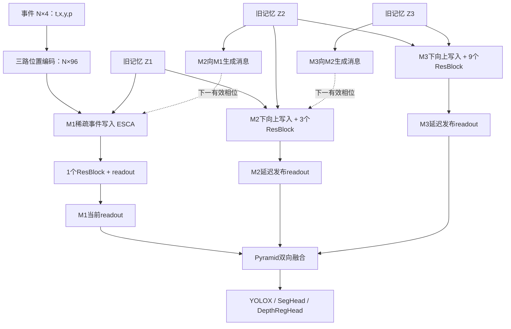

# 05｜HMNet 三任务 B3 算子结构、张量尺寸与 ONNX 查看指南

日期：2026-09-17。依据当前 checkout 的实际配置、模型实例、官方权重严格加载、模块执行记录和 ONNX 图编写。**本轮梳理原始 B3，不实施 EfficientViT、HWAware 或 S-FIFO 替换。** 全部尺寸顺序为 H×W；本轮导出固定 batch=1、FP32。

## 1. 本次交付与使用范围

用于算子浏览的**onnxsim简化版与节点削减统计见第9.5节**；下表及第8节仍保留原始导出信息，便于对照。

三个任务对应四套导出：GEN1检测、DSEC分割、Eventscape深度、MVSEC深度。深度的两套权重、空间网格和输出米制参数不同，分别导出，不能交换使用。

| 任务/配置 | 检查与导出所用权重 | 输入空间 H×W | ONNX完整单步图 |
|---|---|---:|---|
| GEN1 HMNet-B3 TBPTT | `pretrained/gen1_hmnet_B3_tbptt.pth` | 240×304 | [detection/hmnet_b3_step.onnx](../artifacts/onnx/detection/hmnet_b3_step.onnx) |
| DSEC HMNet-B3 | `pretrained/dsec_hmnet_B3.pth` | 440×640 | [segmentation/hmnet_b3_step.onnx](../artifacts/onnx/segmentation/hmnet_b3_step.onnx) |
| Eventscape HMNet-B3 | `pretrained/eventscape_hmnet_B3.pth` | 256×512 | [depth_eventscape/hmnet_b3_step.onnx](../artifacts/onnx/depth_eventscape/hmnet_b3_step.onnx) |
| MVSEC HMNet-B3 | `pretrained/mvsec_hmnet_B3.pth` | 260×348，已padding | [depth_mvsec/hmnet_b3_step.onnx](../artifacts/onnx/depth_mvsec/hmnet_b3_step.onnx) |

对应源码配置：[检测](../experiments/detection/config/hmnet_B3_yolox_tbptt.py)、[分割](../experiments/segmentation/config/hmnet_B3.py)、[深度](../experiments/depth/config/hmnet_B3.py)。检测短序列B3和TBPTT B3的本表网络结构相同，训练方式和权重不同；本轮选择当前检测评估使用的TBPTT权重。

- 每套包含完整单步图、事件编码图、M1/M2/M3计算分图、neck/head分图；分割另外含训练辅助头图。
- 全部原始checkpoint以`strict=True`加载，未用随机初始化补缺键。学习得到的初始记忆作为`initial_state.npz`交付。
- 本文详细结构以**事件单模态 B3**为主。RGB融合变体的额外结构在第10节说明，未把事件权重冒充融合权重。
- 这不是将整段Python训练循环打包为ONNX。数据读取、增强、损失、反向、优化器、NMS、几何逆变换和CUDA跨流/进程调度不在图内。
- ONNX与审计报告位于已有忽略目录`artifacts/onnx/`，导出工具位于已有忽略目录`.local/onnx-export/`。没有修改ignore规则或新增`!`例外。

## 2. 全网络的数据流



**箭头不是同一tick内的串行CNN。** [HMNet._forward_one_step](../hmnet/models/base/backbone/hmnet.py)先取得三个旧状态，再按M3、M2、M1的顺序调用。M2使用该步开始时的Z1，M3使用该步开始时的Z2；不能直接接刚算出的新Z1/Z2。三层空间网格与更新频率均不同。

### 2.1 特征及持久latent尺寸

记号：`L_i=H_i×W_i`；内部`SeqData.data=[B,L_i,C_i]`；卷积前后转换为`[B,C_i,H_i,W_i]`。转换主要是reshape和transpose，硬件实现仍须考虑实际布局和搬运。

| 配置 | M1：C=128 | M2：C=256 | M3：C=256 | L1 / L2 / L3 |
|---|---|---|---|---|
| GEN1 | 60×76 | 30×38 | 15×19 | 4560 / 1140 / 285 |
| DSEC | 110×160 | 55×80 | 28×40 | 17600 / 4400 / 1120 |
| Eventscape | 64×128 | 32×64 | 16×32 | 8192 / 2048 / 512 |
| MVSEC | 65×87 | 33×44 | 17×22 | 5655 / 1452 / 374 |

三层对neck输出的通道统一为**256**，而非内部的128/256/256。奇数尺寸经k3/s2/p1卷积向上取整，例如DSEC的55→28；不能把所有尺寸直接按整除16推算。

GEN1的`vector_latent=False`：每层初始参数为`[1,L_i,C_i]`。其余三套`vector_latent=True`：参数为`[1,1,C_i]`，初始化时复制到全部位置；运行时仍维护完整`[1,L_i,C_i]`状态，**不是只有一个token的记忆**。

### 2.2 通用算子约定

| 记号 | 此仓库实际语义 |
|---|---|
| LN(C) | LayerNorm最后一个通道轴，eps=1e-5，带缩放和偏置 |
| GN(C) | GroupNorm，组数C/32；C=128时4组，C=256时8组；eps=1e-5 |
| BN | BatchNorm2d；eval时使用running statistics；YOLOX eps=1e-3，neck/分割头eps=1e-5 |
| Linear(a,b) | token最后一维全连接，通常有bias；可视作逐位置通道投影，但实际张量布局不同 |
| Conv(k,s,p,g) | 标明kernel/stride/padding/groups；以下未特别注明时g=1，**不是深度可分离卷积** |
| FFN(C) | Linear(C,4C) → GELU → Linear(4C,C)，另有配置为0的Dropout |
| bilinear resize | 显式目标H×W，align_corners=False；多处上/下采样均使用插值 |

`SiLU(x)=x·sigmoid(x)`，GELU和Softmax也没有被替换为ReLU。GN/LN依赖当前输入统计，不能像eval BN一样直接折进卷积。

## 3. 事件编码与 M1 稀疏写入

源码：[EventEmbedding / EventWrite / SparseCrossAttention](../hmnet/models/base/backbone/latent_memory.py)、[位置编码](../hmnet/models/base/backbone/vit.py)。

### 3.1 事件输入与三路编码

每个事件为`t,x,y,p`，原模型极性为-1/+1。窗口5 ms，离散时间100 bins，每bin 50 μs。M1每个latent对应4×4输入像素。

```text
t0 = current_time - 5000
时间bin = trunc((t - t0) / 50)
局部坐标 = (x mod 4, y mod 4)
query_index = trunc(y/4) × W1 + trunc(x/4)
```

| 分支 | 输入预处理 | 网络 | 输出 |
|---|---|---|---|
| xy | 局部xy减(2,2) | Linear(2,32) → LN(32) → ReLU → Linear(32,32) | [N,32] |
| time | `(bin−50)/100` | Linear(1,32) → LN(32) → ReLU → Linear(32,32) | [N,32] |
| polarity | 原始-1/+1，不作索引替换 | Linear(1,32) → LN(32) → ReLU → Linear(32,32) | [N,32] |
| concat | 按xy/time/polarity顺序拼接 | Concat | [N,96] |

这是坐标MLP，不是图像stem卷积。当前配置没有先生成VoxelGrid或TimeSurface再送入骨干。

原工程可预生成事件K/V查表：100×4×4×2=3200种组合，两张`[3200,4,32]`表，FP32约3.125 MiB；本次ONNX展开MLP和K/V线性层，便于查看全部算子，没有将它们隐藏为大查表。

### 3.2 EventWrite 的算子链

| 步骤 | 输入 → 输出 | 算子 |
|---|---|---|
| query | Z1 `[1,L1,128]` → `[L1,4,32]` | LN128 → Linear128→128 → reshape → 乘1/√32 |
| key/value | event `[N,96]` → K/V各`[N,4,32]` | LN96 → Linear96→256 → reshape/split |
| 选择query | `[L1,4,32]` → `[N,4,32]` | 按query_index进行Gather |
| 打分 | Q/K → `[N,4]` | 元素乘 → 对32维ReduceSum |
| 分组归一化 | 每个latent/每个head单独归一化 | ScatterMax → Exp → ScatterAdd → 除法 |
| 噪声槽 | 每head一个可学习dustbin logit | 与真实事件共同进入归一化分母，dustbin无对应V消息 |
| 消息 | attention×V → `[L1,128]` | 加权 → ScatterAdd → reshape |
| 残差投影 | `[1,L1,128]` | Linear128→128 → 与旧Z1相加 |
| FFN | `[1,L1,128]` → 同尺寸 | LN128 → Linear128→512 → GELU → Linear512→128 → 残差Add |

原分母额外加`1e-7`。本轮ONNX的三处ScatterElements分别做max、sum、sum；indices为int64。稀疏注意力只在同一latent关联的事件中归一化，不能用全局事件Softmax替换。

空事件窗口时，原模型**跳过整个EventWrite，包括其FFN**；但时钟和后续记忆更新仍继续。导出接口用`event_valid`掩码表达，全部False时保留写入前状态。

## 4. M2/M3 写入、跨层消息与三层空间更新

### 4.1 下向上写入 WriteBottomUp

M2：输入Z1，输出更新Z2。M3：输入Z2，输出更新Z3。两者结构相同，通道差别见表。

| 步骤 | M2通道 | M3通道 | 空间/算子 |
|---|---|---|---|
| 下采样预归一化 | 128 | 256 | GN → SiLU |
| 下采样 | 128→128 | 256→256 | Conv3×3，s2，p1，g1，bias=False |
| 输入投影 | 128→256 | 256→256 | GN → SiLU → Conv1×1，bias=False；M3的同通道投影也存在 |
| 跨注意力 | Q来自本层，K/V来自下采样后的下层 | 同左 | 两侧LN256 → 7×7窗口CrossAttention |
| 残差 | 256 | 256 | 与写入前latent相加 |
| FFN | 256→1024→256 | 同左 | LN256 → Linear → GELU → Linear → 残差Add |

### 4.2 7×7窗口 CrossAttention

对本层网格补齐到7的整数倍，再拆为`[B×nW,49,256]`。Q/K/V为`[B×nW,8,49,32]`。

```text
Q = Linear(256,256)
K,V = split(Linear(256,512))
scores = (Q / sqrt(32)) @ K^T               # [B*nW,8,49,49]
scores += relative_position_bias            # [1,8,49,49]
attention = Softmax(scores, dim=-1)
message = attention @ V                     # [B*nW,8,49,32]
message = Linear(256,256)(拼接heads)
逆窗口重排 → 去除padding → 原网格
```

每个CrossAttention有独立的13×13×8相对位置偏置参数表。配置`pos_dynamic=False`表示不使用动态位置MLP，**不是关闭相对位置偏置**。

本配置`cyclic_shift=False`；源码对补零token未增加额外padding attention mask。导出保持原行为，硬件实现不能擅自加mask改变数值。

| 配置 | M2补齐网格 / 窗口数 | M3补齐网格 / 窗口数 |
|---|---|---|
| GEN1 | 35×42 / 30 | 21×21 / 9 |
| DSEC | 56×84 / 96 | 28×42 / 24 |
| Eventscape | 35×70 / 50 | 21×35 / 15 |
| MVSEC | 35×49 / 35 | 21×28 / 12 |

每个窗口的attention矩阵为8×49×49个数。以DSEC M2为例，单个完整矩阵约7.03 MiB FP32；这是某个中间张量的大小，**不是总峰值显存**。可以按窗口分块调度，不必全部物化。

### 4.3 上向下消息 MessageGen / WriteTopDown

M2向M1发消息、M3向M2发消息。消息生成读取本层和下层的**旧latent**，并不读取本层本步写入后的结果。

| 步骤 | M2→M1 | M3→M2 |
|---|---|---|
| 对下层做PatchMergingCross | LN128 → Conv3×3/s2/p1，128→128 | LN256 → Conv3×3/s2/p1，256→256 |
| 投影到注意力通道 | LN128 → GELU → Linear128→256 | LN256 → GELU → Linear256→256 |
| query / context | Q=处理后的下层；K/V=本层旧latent，双方LN256 | 同左 |
| 注意力 | 8 heads，7×7窗口，head dim32 | 同左 |
| 输出投影 | LN256 → GELU → Linear256→128 | LN256 → GELU → Linear256→256 |
| 恢复下层空间网格 | bilinear resize到H1×W1 | bilinear resize到H2×W2 |
| WriteTopDown | 下层Z += message；再加LN→FFN的残差 | 同左 |

这里的`merge`由**LN + stride-2卷积**实现，不是Swin里四邻域拼接后Linear的PatchMergingSwin。

### 4.4 三层 Update：真正的 ResBlock 组成

每次执行更新先做一次LN(C)，再转NCHW。随后依次执行对应层的ResBlock：

```text
                    ┌────────────────────────────────────────┐
x ── Conv3×3(C,C) ── GN(C) ── SiLU ── Conv3×3(C,C) ── GN(C) ── Add(x) ── SiLU
```

两个卷积均stride1/padding1/groups1/bias=False，通道和空间不变。M1执行1个，M2执行3个，M3执行9个；总共13个ResBlock、26个3×3卷积。这里没有TransformerBlock，也没有EfficientViT。

随后readout：

```text
更新后的 [B,L,C]
 → LN(C)
 → Linear(C,256)
 → LN(256)
 → GELU
 → [B,256,H,W]
```

因此readout不只是一个1×1投影；它包括两个LN。模块名、eps和每次执行shape见各任务`module_shapes.tsv`。

## 5. 三任务共享的 Pyramid neck

输入`R1/R2/R3`均为256通道。本配置`input_proj=False`，输入投影是Identity，没有额外层，也没有更低分辨率extra stage。

依次执行：

```text
A1 = R1
A2 = Conv3×3+BN+ReLU(R2 + bilinear_resize(R1, size(R2)))
A3 = Conv3×3+BN+ReLU(R3 + bilinear_resize(A2, size(R3)))
P3 = A3
P2 = Conv3×3+BN+ReLU(A2 + bilinear_resize(P3, size(A2)))
P1 = Conv3×3+BN+ReLU(A1 + bilinear_resize(P2, size(A1)))
```

四个Conv均256→256、stride1/padding1/groups1/bias=False。共有4次resize、4次Add、4个Conv+BN+ReLU，输出网格与输入相同。bottom-up路径用的是**双线性下采样**，不是stride2卷积。

## 6. 三个任务头的具体结构

### 6.1 GEN1：YOLOX检测头

每个P_i有独立参数的分类和回归分支，无共享stem：

```text
P_i [B,256,H_i,W_i]
 ├─ (Conv3×3 256→256 + BN + SiLU) ×2 ─ Conv1×1 256→2  → class_logits
 └─ (Conv3×3 256→256 + BN + SiLU) ×2
          ├─ Conv1×1 256→4 → bbox_raw
          └─ Conv1×1 256→1 → objectness_logit
```

三个尺度共12个3×3卷积、9个1×1卷积。分类2类，单网格单anchor。分辨率及输出：

| 尺度 | 网格 | bbox / objectness / class张量 | 候选框数 | stride |
|---|---|---|---:|---:|
| P1 | 60×76 | [1,4/1/2,60,76] | 4560 | 4 |
| P2 | 30×38 | [1,4/1/2,30,38] | 1140 | 8 |
| P3 | 15×19 | [1,4/1/2,15,19] | 285 | 16 |

ONNX已包含Sigmoid和解码：`cxcy=(raw_xy+grid)*stride`，`wh=exp(raw_wh)*stride`。拼接输出`[1,5985,7]`，最后维度为`cx,cy,w,h,obj_prob,car_prob,pedestrian_prob`。**不是xyxy、不是已执行NMS后的框**。类别得分组合、阈值过滤、NMS和几何逆变换由图外执行。训练时的SimOTA、IoU/BCE/L1损失也不在图内。

### 6.2 DSEC：分割主头和辅助头

主头只使用neck的P1；P2/P3通过neck间接影响P1。

```text
P1 [1,256,110,160]
 → Conv3×3 256→256 + BN + ReLU + Dropout(训练p=0.1，eval关闭)
 → Conv1×1 256→11（有bias）
 → bilinear resize 到 [1,11,440,640] logits
 → Softmax(channel) 概率
```

训练辅助头结构相同，输入为**neck之前的R1**，不是P1；辅助CE系数0.4，主CE系数1，ignore_index=255。辅助头没有参与主推理图，另导出`auxiliary_head.onnx`供查看。类别ArgMax放在图外；ONNX主图返回logits和概率。

### 6.3 深度：DepthRegHead

本B3没有多级learned upsampling，`num_upsampling=0`。头同样只直接使用P1：

```text
P1 [1,256,H1,W1]
 → Conv3×3 256→256 + GN(8组) + SiLU + Dropout(训练p=0.1)
 → Conv1×1 256→1（有bias）
 → bilinear resize到输入大小，得到depth_logits
 → Sigmoid，得到 normalized_log_depth
 → Exp换算为米
```

米制公式：`depth = max_depth * exp(log(max_depth/min_depth) * (sigmoid(logit)-1))`。

| 数据 | 输出米制张量 | min_depth / max_depth | 图外几何处理 |
|---|---|---|---|
| Eventscape | [1,1,256,512] | 3.346 / 1000 m | 按该数据预处理协议 |
| MVSEC | [1,1,260,348] | 1.978 / 80 m | 原始宽346，左右padding到348；需要逆变换回原视野 |

训练包含SIGLoss和多尺度梯度匹配GMLoss，GT有效mask、Sobel/池化等仅属于损失计算，不在推理图内。

## 7. 时钟、状态和输出发布：部署不能忽略的部分

### 7.1 原始调度

本配置`start_from_cycle_end=True`，time_idx从0开始。对频率f：

```text
cycle_start(t) = ((t-1) mod f == 0)
cycle_end(t)   = (t mod f == 0)
message_warm(t)= (t > f+1)
```

| 层 | f | 写入+Update+readout执行时刻 | readout发布时刻 | 消息生成时刻 |
|---|---:|---|---|---|
| M1 | 1 | 每个tick | 同tick | 不向下生成消息 |
| M2 | 3 | 1,4,7,10,… | 3,6,9,12,… | cycle_end；通过warmup后才有效 |
| M3 | 9 | 1,10,19,… | 9,18,27,… | cycle_end；通过warmup后才有效 |

生成消息与接收消息存在时间差。M2首次有效消息在t=6生成供下一步使用；M3首次有效消息在t=18生成。M1始终检查上一步M2消息，M2在自己的写入相位检查上一步M3消息。

原始推理第一次三路readout齐备是t=9。训练包装器另外使用`backbone.warmup=20`筛选监督，二者不可混淆。导出`prediction_valid`仅表示原骨干三路readout已齐备，**不代表有GT或已经通过训练监督warmup**。

### 7.2 导出的显式状态

输入输出状态逐项对应，调用方负责在序列开始加载`initial_state.npz`、设置`tick=0`，并逐步将`next_*`回填。不同视频不能共用未reset的状态。

| 状态名 | 尺寸 | 含义 |
|---|---|---|
| z1/z2/z3 | [1,L_i,C_i] | 三层完整latent |
| message2 | [1,L1,128] | 上一步M2生成、供M1使用的消息，未生成则零 |
| message3 | [1,L2,256] | 上一步M3生成、供M2使用的消息，未生成则零 |
| pending2/3 | [1,256,H_i,W_i] | 已算好但尚未到发布时刻的readout |
| published2/3 | 同上 | 当前可被neck读取的readout |
| tick / next_tick | int64标量 | 周期计数；不是事件timestamp |

没有保存published1，因为M1每步都会产生新readout。主图另返回三路Pyramid输出，方便观察内部张量；它们不是需要回填的持久状态。

### 7.3 ONNX运行的计算成本边界

主图为了同时呈现所有算子，用`Where`选择状态更新与发布结果，**每次调用会计算三个层的候选更新和消息路径**；不等价于只在1/3/9相位实际执行对应算子的优化实现。数值选择语义按原模型实现，但不能拿整图耗时冒充HMNet原多速率延迟。

真实硬件部署应使用分图，并由控制器按相位调度；进一步可将MessageGen与write/update拆成独立可调度单元。本次`memory2_compute.onnx`和`memory3_compute.onnx`同时展示这两条路径，二者在原模型中的执行相位不同。

## 8. 参数量、状态存储与算子清单

| 配置 | 完整模型参数 | Backbone | Neck | 主头 / 辅助头 | 三层latent MiB | 九项状态 MiB |
|---|---:|---:|---:|---:|---:|---:|
| GEN1检测 | 29,772,537 | 20,321,764 | 2,361,344 | 7,089,429 | 3.618 | 9.741 |
| DSEC分割 | 22,921,594 | 19,373,924 | 2,361,344 | 593,163 / 593,163 | 13.984 | 37.656 |
| Eventscape深度 | 22,325,861 | 19,373,924 | 2,361,344 | 590,593 | 6.500 | 17.500 |
| MVSEC深度 | 22,325,861 | 19,373,924 | 2,361,344 | 590,593 | 4.544 | 12.290 |

| 骨干参数组成 | M1 | M2 | M3 |
|---|---:|---:|---:|
| 检测（使用逐位置初始latent） | 1,238,980 | 5,879,696 | 13,203,088 |
| 分割/两种深度（使用广播初始latent） | 655,428 | 5,588,112 | 13,130,384 |

**完整单步ONNX图中的关键算子数量**（包括每步全部候选分支；不含分割辅助头）：

| 算子 | 检测 | 分割 | Eventscape深度 | MVSEC深度 |
|---|---:|---:|---:|---:|
| Conv | 57 | 38 | 38 | 38 |
| Gemm | 7 | 7 | 7 | 7 |
| MatMul | 39 | 39 | 39 | 39 |
| LayerNormalization | 33 | 33 | 33 | 33 |
| InstanceNormalization | 30 | 30 | 31 | 31 |
| BatchNormalization | 16 | 5 | 4 | 4 |
| Softmax | 4 | 5 | 4 | 4 |
| ScatterElements | 3 | 3 | 3 | 3 |
| Resize | 6 | 7 | 7 | 7 |
| Exp | 5 | 2 | 3 | 3 |
| Erf | 12 | 12 | 12 | 12 |
| Where | 15 | 15 | 15 | 15 |
| 总节点数 | 3292 | 3027 | 3047 | 3048 |

Conv计数包含Update、跨层下采样、neck与任务头；Gemm/MatMul同时涵盖Linear和注意力矩阵乘。ONNX文件还含常量、固定网格与零缓冲，文件大小不等于参数量×4。MiB=2²⁰ bytes。

统计口径：参数量来自完整PyTorch模型，分割包含训练辅助头；ONNX主图不包含辅助头和作为外部reset输入的学习初始latent。persistent状态字节数按本次显式接口计算，未计weights、算子workspace、中间特征、输入事件、输出图、训练激活和多进程复制，不能当成峰值显存。

### 8.1 逐算子原始记录

| 配置 | PyTorch完整模块树 | 模块输入/输出/超参数 | ONNX逐节点输入/输出/shape |
|---|---|---|---|
| 检测 | [structure](../artifacts/onnx/detection/pytorch_structure.txt) | [module_shapes.tsv](../artifacts/onnx/detection/module_shapes.tsv) | [step.nodes.tsv](../artifacts/onnx/detection/hmnet_b3_step.nodes.tsv) |
| 分割 | [structure](../artifacts/onnx/segmentation/pytorch_structure.txt) | [module_shapes.tsv](../artifacts/onnx/segmentation/module_shapes.tsv) | [step.nodes.tsv](../artifacts/onnx/segmentation/hmnet_b3_step.nodes.tsv) |
| Eventscape深度 | [structure](../artifacts/onnx/depth_eventscape/pytorch_structure.txt) | [module_shapes.tsv](../artifacts/onnx/depth_eventscape/module_shapes.tsv) | [step.nodes.tsv](../artifacts/onnx/depth_eventscape/hmnet_b3_step.nodes.tsv) |
| MVSEC深度 | [structure](../artifacts/onnx/depth_mvsec/pytorch_structure.txt) | [module_shapes.tsv](../artifacts/onnx/depth_mvsec/module_shapes.tsv) | [step.nodes.tsv](../artifacts/onnx/depth_mvsec/hmnet_b3_step.nodes.tsv) |

模块记录使用64行合成事件、batch1、全部候选计算分支；它列出Conv/Linear/Norm/activation的真实执行shape。Add、MatMul、Gather、Scatter等functional操作则由ONNX节点表补足。Dropout在PyTorch结构中存在，在eval ONNX中通常消失。ONNX的Constant/Shape/Unsqueeze等大量节点是形状构造，不能简单按总节点数估计计算量。

计算预算应分别统计：Conv的`B*Hout*Wout*Cout*(Cin/groups)*Kh*Kw` MAC；Linear的`token数*Cin*Cout` MAC；注意力的两次矩阵乘、稀疏scatter、归一化/Exp/除法和resize开销。一个MAC是一次乘加，若计作2 FLOPs须单独声明。以上是公式，本文没有用算子数量冒充实测吞吐率。

## 9. ONNX文件接口、检查结果与查看方法

### 9.1 文件布局

```text
artifacts/onnx/
  detection/              # GEN1 B3 TBPTT
  segmentation/           # DSEC B3，另有 auxiliary_head.onnx
  depth_eventscape/       # Eventscape B3
  depth_mvsec/            # MVSEC B3
    hmnet_b3_step.onnx    # 完整显式状态单步图
    event_encoder.onnx   # 坐标/时间/极性 → embedding/query_indices
    memory1_compute.onnx # top-down + ESCA + update + readout
    memory2_compute.onnx # top-down + bottom-up + update/readout；另返回旧状态生成的message
    memory3_compute.onnx # bottom-up + update/readout；另返回旧状态生成的message
    neck_head.onnx       # 三路readout → Pyramid → 任务输出
    initial_state.npz    # reset用的九个初始状态tensor
    manifest.json        # 配置、checkpoint、SHA256、参数量、IO和验证结果
    validation.json      # 21个tick的逐输出误差
    component_validation.json
    *.nodes.tsv          # 各图的算子/边/输出shape
```

所有图opset=18、标准ONNX域，未留下ATen或torch_scatter自定义后端节点。ScatterMax通过导出适配器映射到标准[ScatterElements(reduction=max)](https://onnx.ai/onnx/operators/onnx__ScatterElements.html)，sum也使用该标准算子。GN通常展开为reshape+InstanceNormalization+仿射，SiLU展开为Sigmoid+Mul，GELU展开为Erf等；LN保留为LayerNormalization。

### 9.2 主图输入约定

- `events`: float32 `[N,4]`，N动态、N≥1；空间尺寸固定；p=-1/+1。
- `event_valid`: bool `[N]`，标识有效事件。空窗口传至少一行合法padding事件、mask全False。
- `current_time`: float32标量，与events[:,0]采用同一个时间原点。
- 为避免长序列绝对微秒timestamp转float32损失精度，建议在图外以int64减去当前窗口起点，再将窗口内t转换成float32；此时current_time固定5000，事件t在[0,5000)内。tick独立递增。
- 即使是mask=False的padding行，也要求x/y在图像范围内且数值有限，因为Gather在掩码合并前执行。
- 其余九个状态输入见第7节；不能仅传一张图像调用这个事件网络。
- Batch、H/W、5 ms窗口和注意力窗口在导出时固定；更改后需重新导出。动态N不代表动态空间或动态batch。

`prediction_valid=False`时图仍为固定形状返回任务输出，调用方须丢弃它；原Python推理在该阶段不运行任务头。

### 9.3 实际验证结果

环境：Python 3.12.2, PyTorch 2.5.0, ONNX 1.17.0, ONNX Runtime 1.20.2；全部使用CPUExecutionProvider，避免占用正在运行任务的GPU。

**25/25个图通过ONNX结构检查并能在ORT执行；24/25个图通过以下单次前向容差，分割完整step图的logits例外。** 判据为逐元素 `abs(ORT−PyTorch) ≤ atol + rtol×abs(PyTorch)`：

- 适配器对原PyTorch实现：atol=rtol=8e-4。四套模型21步均通过。
- ORT单次前向：一般输出atol=rtol=5e-4；深度米制输出单列atol=rtol=1e-3。
- ORT独立连续反馈：atol=rtol=2e-3。四套主测试均通过；不代表逐元素完全相同。

| 配置 | 单次前向分图通过数 | 主测试连续21步 | 主任务输出最大绝对误差（连续测试） |
|---|---|---|---|
| GEN1检测 | 6/6 | 通过 | detections_cxcywh_obj_cls: 0.000793457 |
| DSEC分割 | 6/7 | 通过 | logits: 0.003791809；probabilities: 0.0005419552 |
| Eventscape深度 | 6/6 | 通过 | depth_logits: 0.001717091；depth_meters: 0.3991699 m |
| MVSEC深度 | 6/6 | 通过 | depth_logits: 0.0004444122；depth_meters: 0.009815216 m |

表中连续测试误差统计覆盖全部21个tick，包括预热时固定返回但应丢弃的预测；不是数据集精度指标。

分割完整图单次前向的`logits`最大绝对差为0.001817703，最大容差占用为1.324倍；其概率、状态及全部独立分图通过对应单次检查。没有调大该项阈值掩盖超限。深度米制输出的较大绝对差应结合深度范围与相对容差看待，不能等同于模型在真实数据上已有相应精度损失或精度保持。

**补充稀疏事件压力测试**：将N=1窗口也全部mask掉，DSEC的21步结果为未全部通过；超限发生在tick=[19, 20]的`next_z3`状态，跨全部输出最大绝对差0.008737564。这说明主测试通过不能排除不同事件密度下的循环误差累积。详见[压力测试逐输出记录](../artifacts/onnx/segmentation/stress_masked_single/validation.json)。

各任务的`manifest.json`记录checkpoint SHA256、配置SHA256、源码commit、工具SHA256、输出shape及MVSEC运行时配置覆盖值。

检查包含：官方权重严格加载；ONNX checker/full shape check；所有图使用标准域；每个分图与PyTorch单次前向比较；主图与原始HMNet单线程实现的状态/输出比较（没有认证CUDA多流/多进程路径的等价性）；独立ORT状态连续反馈21步；N=1/17/64以及空事件窗口。没有运行真实数据上的ONNX全量mAP/mIoU/深度误差评估，没有验证TensorRT或Dremi算子支持。

数值检查必须区分：

1. **PyTorch适配器与原源码**：验证显式状态、消息时刻和输出发布是否保持原计算语义。
2. **ONNX单次前向**：验证导出算子与相同输入的浮点计算。
3. **连续ORT状态反馈**：在每步接收自身上一步结果，观察跨后端数值差异是否累积。此项的失败不能用“checker通过”掩盖。

FP32深度米制输出经过Exp换算，会放大logit差异。检查报告分别保存逐输出max_abs、RMSE或容差比例；不能把米制绝对误差直接当作分割概率误差。出现循环容差超限的图仍可用于结构浏览，精度敏感部署需先完成长序列及真实数据校准。

### 9.4 如何逐级看

使用支持ONNX的本地模型查看器打开对应文件，推荐先看`neck_head.onnx`，再看三个`memory*_compute.onnx`，最后看完整step图。按节点名前缀搜索`encoder`、`memory1/event_write`、`memory2/memory/write_bottom_up`、`message_gen`、`update`、`task/neck`和`task/head`。每个节点的shape也可在`.nodes.tsv`中查找；动态事件维度以`event_rows`或推断符号表示。

不需要向外部网页上传权重。本轮未安装查看器或发布网络服务。

导出重建入口（当前环境，项目根目录）：

```bash
OMP_NUM_THREADS=2 MKL_NUM_THREADS=2 ./scripts/hmnet-python -B .local/onnx-export/export_b3.py --task detection
OMP_NUM_THREADS=2 MKL_NUM_THREADS=2 ./scripts/hmnet-python -B .local/onnx-export/export_b3.py --task segmentation
OMP_NUM_THREADS=2 MKL_NUM_THREADS=2 ./scripts/hmnet-python -B .local/onnx-export/export_b3.py --task depth_eventscape
OMP_NUM_THREADS=2 MKL_NUM_THREADS=2 ./scripts/hmnet-python -B .local/onnx-export/export_b3.py --task depth_mvsec
OMP_NUM_THREADS=2 MKL_NUM_THREADS=2 ./scripts/hmnet-python -B .local/onnx-export/verify_components.py detection segmentation depth_eventscape depth_mvsec
```

主图循环反馈样例为[run_step.py](../.local/onnx-export/run_step.py)，已实际运行检测12步，验证tick 0–8丢弃预测、tick 9起输出有效。执行：

```bash
./scripts/hmnet-python -B .local/onnx-export/run_step.py --task detection --ticks 12
```

补充稀疏事件测试入口为`.local/onnx-export/check_segmentation_stress.py`。导出工具与报告位于本地忽略目录；工程模型实现未改动。

### 9.5 onnxsim简化版（建议用于逐级查看）

使用当前`pytorch`环境已有的onnxsim 0.4.36处理全部25个ONNX，原图保留。工具参考：[onnxsim官方说明](https://github.com/onnxsim/onnxsim)。简化版位于各任务的`simplified/`子目录，同名文件可直接打开。

| 完整单步图 | 节点数：原始 → 简化 | Cast：原始 → 简化 | 简化后节点减少 |
|---|---:|---:|---:|
| [GEN1检测](../artifacts/onnx/detection/simplified/hmnet_b3_step.onnx) | 3292 → 808 | 82 → 9 | 75.5% |
| [DSEC分割](../artifacts/onnx/segmentation/simplified/hmnet_b3_step.onnx) | 3027 → 723 | 74 → 9 | 76.1% |
| [Eventscape深度](../artifacts/onnx/depth_eventscape/simplified/hmnet_b3_step.onnx) | 3047 → 732 | 74 → 9 | 76.0% |
| [MVSEC深度](../artifacts/onnx/depth_mvsec/simplified/hmnet_b3_step.onnx) | 3048 → 732 | 74 → 9 | 76.0% |

全部25个图合计：节点24,685 → 5,883；Cast 609 → 72。M2/M3计算分图以及neck/head中的Cast均已清零。

**处理方式与接口：**

- 使用`onnxsim.simplify(..., skip_fuse_bn=True)`，执行常量折叠、形状推导与冗余节点消除；保留BatchNorm以便逐层对照。
- 没有设置`overwrite_input_shapes`，动态`event_rows`保留；输入输出名称、dtype、维度与状态协议均通过一致性检查。
- 完整图保留9个Cast：事件编码中的7个FLOAT/INT64转换，以及ESCA中的2个BOOL→FLOAT/INT64转换；这些参与取整、索引、掩码计算，不能直接删除。
- 常量折叠会将部分运行时生成的张量存成initializer。图节点更少不保证文件更小，也不代表已测得部署加速。

**实际验证：**

25/25个图通过ONNX完整结构检查和简化前后ORT数值对照；本轮测试最大绝对差为0。浮点判据atol=1e-5、rtol=1e-4；整数与bool要求完全一致。

- 事件编码/M1分图：N=1/17/64/257，包含重复索引、边界坐标、有效/空事件窗口；其他分图使用两组输入。
- 四套完整图：分别连续运行21个tick，原图和简化图独立回填各自状态，覆盖预热、发布和上层消息反馈。
- 使用CPUExecutionProvider、每会话2线程。onnxsim内置随机检查设为`check_n=0`，避免随机非法坐标；以上结果来自额外执行的合法输入对照，不能把该开关本身视为已验证。
- 这是“简化前ONNX vs 简化后ONNX”检查。第9.3节记载的PyTorch→ONNX数值差异仍然存在，尚无真实数据精度/硬件耗时结论。

**文件与复现：**

每个`simplified/`目录包含同名ONNX、更新后的`*.nodes.tsv`、可直接加载的`initial_state.npz`和`simplification_report.json`。报告逐图记录算子计数、SHA256、文件大小和逐输出误差；汇总见[简化统计](../artifacts/onnx/simplification_summary.json)。

```bash
# 项目根目录；task可选detection/segmentation/depth_eventscape/depth_mvsec
OMP_NUM_THREADS=2 MKL_NUM_THREADS=2 ./scripts/hmnet-python -B .local/onnx-export/simplify_b3.py --task segmentation
./scripts/hmnet-python -B .local/onnx-export/run_step.py --task segmentation --simplified --ticks 12
```

简化脚本及全部模型/报告继续位于既有忽略目录；没有新增`.gitignore`例外。

## 10. RGB融合B3的额外结构（本次未导出该变体）

分割`hmnet_B3_fuse_left_rgb.py`和深度`hmnet_B3_fuse_rgb.py`在M3增加`ImageWrite`；原事件骨干并没有图像stem。这些配置需要独立权重与融合训练，不应把RGB支路加入后仍称已严格加载完整事件checkpoint。

当前配置使用ResNet图像编码器：

```text
3通道图像
 → Conv3×3/s2 3→64 + BN + ReLU
 → Conv3×3/s1 64→64 + BN + ReLU
 → Conv3×3/s1 64→128 + BN + ReLU
 → MaxPool3×3/s2/p1
 → ResStage：2个BasicBlock，128→64，stride1
 → ResStage：2个BasicBlock，64→128，首块stride2
 → ResStage：2个BasicBlock，128→256，首块stride2
 → LN后的图像token，与M3的LN latent进行7×7 CrossAttention
 → 残差与FFN
```

编码器输出约为图像/16网格：DSEC 28×40、Eventscape 16×32、MVSEC padding后17×22，256通道。每个BasicBlock主支路为Conv3×3 → BN → ReLU → Conv3×3 → BN；通道/stride变化时，shortcut为Conv1×1 → BN → ReLU（`down_act=True`），两支相加后再ReLU，具体实现见`ResStage/ResBlock`。图像缓存和valid_batch控制写入，不能把无新图像当作输入全零图像。真实单通道Gray是否复制成三通道或修改stem，是后续独立设计选择。

## 11. 对后续硬件改造的直接约束

- 最容易作为第一步替换的是三层`update`中的ResBlock；保留输入输出网格、通道、调度和消息协议，可直接比较官方EfficientViTBlock的作用。
- 仅替换update并不会消除ESCA的Gather/Scatter、窗口Softmax、LN/GN、GELU、双线性resize或深度Exp。部署支持清单应覆盖完整图。
- 最底层M1高频运行，空间网格最大；M3块数多但更新低频。应按实际相位统计算力，不能只看模块参数量排序。
- 跨芯划分不仅传三路readout，也涉及下层latent和上层message；状态尺寸表才是通信和片上存储估算的起点。
- 导出的单步显式状态图用于验证和查看；硬件实现需规划layout、窗口分块、归一化精度、累加位宽、事件buffer容量和相位调度。尚未生成硬件映射或量化模型。
