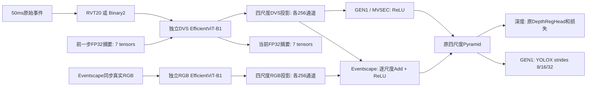

# 同步 v1.2_T：检测与深度的 RVT / Binary 对照

本分支的新任务入口是 `scripts/task_temporal.py`，默认实验由同目录 `experiment.toml` 指定。源骨干为 `seg_rgbdvs_640x440_v1.2_T/76f1a8c`；二值初始化和 `polarity_counts` 来自点号版 `8bd5160`。异步 `_T_1/_T_2`、伪标签和硬件无除法近似不在此实验中。原 HMNet 以及旧非时序 frame 配置仍保留，不能把旧命令当作本实验入口。

|数据集|任务/模态|原生 H×W|训练/评估划分|reset gap|
|---|---|---|---|---|
|GEN1|检测，DVS-only；PEOD为后续实验|240×304|官方 train / val / test|1,500,000 μs|
|Eventscape|深度，真实 RGB-DVS SimpleAdd|256×512|Town01/02/03 train；Town05固定 VAL_IDS / 其余 test|75,000 μs|
|MVSEC|深度，DVS-only|260×346|day2训练；day1/night1测试|75,000 μs|

本地 MVSEC 的 DAVIS 和 VI-Sensor 都是灰度图像，[官方格式说明](https://daniilidis-group.github.io/mvsec/data_format/)亦如此。`blended_image_rect` 是GT可视化，不能当RGB。Eventscape RGB和深度按原时间戳配对，取不晚于GT的最近RGB，最大年龄50ms；原尺寸直接加载，不做DSEC式resize或虚构配准。RGB采用ImageNet标准化。不同数据集独立记账，测试集不选权或调参。

## 模型与训练契约



DVS Stage3三个、Stage4四个LiteMLA使用M=2；状态是**当前**摘要，下一步读当前＋前一步，不能回写累计和。七状态为前三个 `[B,16,17,16]`、后四个 `[B,32,17,16]`，全FP32。其余主计算BF16，标准除法归一化，TBPTT=1，optimizer更新间detach。换序列、流槽起点、翻转变更或超gap时清零。GEN1标签通常间隔250/500/1000ms，M=2表示两个标签步；并非连续100ms。各标签仍仅使用自己的50ms闭区间事件。

RVT保持冻结实现：10bin×两极性，按窗口首末事件分桶、极性优先通道顺序、cutoff10、fastmode uint8回绕。Binary直接从同一原事件调用显式原生尺寸的 `polarity_counts()>0`，无bin或正负抵消，不从RVT反推。完整canonical20模型初始化后才适配二值首层，保证固定seed的非首层参数/缓冲及外部RNG一致；默认官方B1初始化，未使用分割best。

默认每阶段100epoch、batch8、accum1、workers2、seed42、AdamW 2e-4/weight_decay0.01、5epoch warmup-cosine到2e-6。batch8为真实原生尺寸验证的保守第一版，两表示完全一致；没有沿用DSEC batch32或未经验证的accum8。BF16与确定性算子默认启用；确定性双线性插值避免原深度CUDA反向非确定性导致独立运行在恢复前便分歧。此设置写入契约，旧非确定性诊断检查点不可直接resume。

空框仍为合法检测背景；无有效深度帧推进摘要，但跳过loss和optimizer更新。epochs换算成功更新预算，跳过无效监督时可能多遍历数据，不能把更新预算等同精确访问轮数。这里不自动计算每轮验证指标或选best：固定预算保存末权重，使用下方独立val评估入口；不得根据test结果选权。

## 1. 数据准备

原始根目录为 `/data/lab_dataset/RGB_DVS_Fusion/{GEN1,Eventscape,MVSEC}/source`。新索引放各数据集 `preprocessed/hmnet_v12t_raw_v1`，共享给RVT/Binary。不复制大型DAT/NPZ/HDF5、不生成逐帧直方图缓存。输出目录必须不存在，已有完整索引直接复用；正在生成的目录不能重复运行。只有全部split成功才写 `COMPLETE.json`，训练对未完成目录直接拒绝。

```bash
./scripts/hmnet-python scripts/prepare_task_frames.py gen1 \
  --source /data/lab_dataset/RGB_DVS_Fusion/GEN1/source \
  --output /data/lab_dataset/RGB_DVS_Fusion/GEN1/preprocessed/hmnet_v12t_raw_v1
./scripts/hmnet-python scripts/prepare_task_frames.py eventscape \
  --source /data/lab_dataset/RGB_DVS_Fusion/Eventscape/source \
  --output /data/lab_dataset/RGB_DVS_Fusion/Eventscape/preprocessed/hmnet_v12t_raw_v1
./scripts/hmnet-python scripts/prepare_task_frames.py mvsec \
  --source /data/lab_dataset/RGB_DVS_Fusion/MVSEC/source \
  --output /data/lab_dataset/RGB_DVS_Fusion/MVSEC/preprocessed/hmnet_v12t_raw_v1
```

GEN1复用已固定commit的Prophesee DAT读取器及已有整数bbox/无效框/小框规则；标签时间锚点先于过滤生成，空框时刻保留。Eventscape扫描事件包真实端点，不依赖名义包时刻猜窗；MVSEC先扣原事件起始时间，再四舍五入至整数微秒，GT使用原始坐标深度，不插值、不裁剪。两表示均 `[target_us-50000,target_us]`。

索引SHA256、split、样本列表SHA及源文件路径/大小/mtime签名写入checkpoint；GEN1标注和Eventscape时间文件另保存内容SHA。**大型事件档案没有执行全文件内容SHA**，不能把stat签名称为全量事件内容校验。源文件必须保持只读，任何变更重建独立索引。`--sequences 1`只用于另一个诊断目录，并标记为子集，不允许直接正式训练。

## 2. 冒烟、正式训练与恢复

所有命令从对应独立工程根目录执行。先用 `nvidia-smi` 选择空闲卡，示例GPU0只表示设备选择。表示默认来自该分支TOML；可显式 `--representation rvt_histogram` 或 `polarity_binary`。

```bash
# 有界真实batch8三步；不改变100epoch的LR预算，输出不放logs。
CUDA_VISIBLE_DEVICES=0 ./scripts/hmnet-python scripts/task_temporal.py train \
  --limit 32 --stop-after 3 --output artifacts/my_smoke

# 正式训练，用户手动启动；GEN1分支默认GEN1，深度分支默认Eventscape。
CUDA_VISIBLE_DEVICES=0 ./scripts/hmnet-python scripts/task_temporal.py train

# 同一实验恢复：设置、数据、预算必须与保存时一致。
# 按本分支选择 gen1_rvt / gen1_binary / eventscape_rvt / eventscape_binary。
CUDA_VISIBLE_DEVICES=0 ./scripts/hmnet-python scripts/task_temporal.py train \
  --resume logs/detection/gen1_rvt/checkpoint.pth
```

深度Eventscape完成后，MVSEC用对应表示权重显式初始化，重新创建optimizer、RNG起点和空历史状态。仅丢弃 `backbone.rgb_encoder.*`、`backbone.rgb_proj.*`，保留DVS/投影/neck/head，剩余键 `strict=True`；深度输出范围改为1.978–80m。范围改变后原head输出的米制解释随MVSEC参数化变化，是新微调阶段，不能称函数完全不变。禁止用Eventscape checkpoint直接resume MVSEC。

```bash
# RVT深度分支；Binary分支将路径后缀rvt换为binary。
CUDA_VISIBLE_DEVICES=0 ./scripts/hmnet-python scripts/task_temporal.py train --dataset mvsec \
  --init-from logs/depth/eventscape_rvt/checkpoint.pth
CUDA_VISIBLE_DEVICES=0 ./scripts/hmnet-python scripts/task_temporal.py train --dataset mvsec \
  --resume logs/depth/mvsec_rvt/checkpoint.pth
```

`--dataset mvsec`不加init-from是独立官方B1初始化实验，绝不自动声称做了Eventscape微调。训练正式产物在 `logs/{detection,depth}/{dataset}_{rvt,binary}`；smoke、独立评估和ONNX均在artifacts。第一次运行拒绝覆盖已有训练；resume预算是累计预算，不是追加100轮。

## 3. 独立时序评估

```bash
# GEN1：开发集诊断；仅最终冻结权重后才评估test。
CUDA_VISIBLE_DEVICES=0 ./scripts/hmnet-python scripts/task_temporal.py eval --dataset gen1 \
  --checkpoint logs/detection/gen1_rvt/checkpoint.pth --split val --precision fp32

# Eventscape val；最终报告test需固定训练/选权协议。
CUDA_VISIBLE_DEVICES=0 ./scripts/hmnet-python scripts/task_temporal.py eval --dataset eventscape \
  --checkpoint logs/depth/eventscape_rvt/checkpoint.pth --split val --precision fp32

# MVSEC测试集不参与选择权重或超参数。
for split in day1 night1; do
  CUDA_VISIBLE_DEVICES=0 ./scripts/hmnet-python scripts/task_temporal.py eval --dataset mvsec \
    --checkpoint logs/depth/mvsec_rvt/checkpoint.pth --split "$split" --precision fp32
done
```

Binary分支用对应binary路径。GEN1复用现有COCO转换和pycocotools：car/pedestrian，跳过前0.5s，diag≥30、两边≥10，mAP/AP50/AP75和分类别AP。输出恰在标签时刻；相邻GT≥250ms，因此与±25ms匹配一致。官方评分忽略过滤后无GT时刻；这与训练空框仍作为背景是两件事。ONNX检测输出为NMS之前 `[B,1505,7]` 的xywh/objectness/两类概率。

深度复用现有 `evaluate_one_sample`：米制、原有效范围Eventscape3.346–1000m/MVSEC1.978–80m，另报30/20/10m范围，逐帧均值AbsRel/RMSE/a1/a2/a3等。保留Eventscape `skip_ts=199.9ms`；MVSEC不新增crop/稀疏GT插值。三步诊断权重的指标仅验证程序，不能作为训练精度。

## 4. ONNX与验证工具

```bash
# 分支/任务/数据必须与checkpoint相符。GEN1示例：
./scripts/hmnet-python scripts/export_task_temporal.py \
  --checkpoint logs/detection/gen1_rvt/checkpoint.pth \
  --data-root /data/lab_dataset/RGB_DVS_Fusion/GEN1/preprocessed/hmnet_v12t_raw_v1 \
  --split val --output artifacts/onnx/trained
# 骨干图：同命令追加 --backbone-only。
```

Eventscape同样使用val，MVSEC使用day1；各自提供对应root/checkpoint。整网及骨干都有七状态输入/输出，FP32推理、opset17、batch1、原生尺寸。整网输出GEN1 `[1,1505,7]`、Eventscape `[1,1,256,512]`、MVSEC `[1,1,260,346]`。RGB只在Eventscape存在 `[1,3,256,512]`。状态shape如上，报告记录权重SHA、step、Git提交和源码SHA。

导出会完成全部真实序列、全零、reset及融合空事件检查，写 `.report.json` 后再因数值失败返回2。容差保持atol1e-3/rtol1e-4；各后端独立反馈自己的状态。当前12份诊断图结构通过，历史状态仍有超差；不能视为数值一致性或部署验收。初始化来源是官方B1＋随机任务头经过3步诊断更新，未进行正式任务训练。

开发检查：`scripts/check_task_temporal.py`（结构/初始化/梯度/状态），`check_task_data.py`（边界/高计数/真实split，需要先准备artifacts/data_smoke），`check_task_resume.py --dataset ... --representation ... --data-root ...`（真实batch8三步vs2+1，保持预算），`check_task_contracts.py`（已有GEN1诊断checkpoint的错配拒绝）。测试输出拒绝覆盖或需另建目录，旧失败证据单独保留。四工程公共文件由明确清单逐项SHA核对；没有跨工程绝对import。
